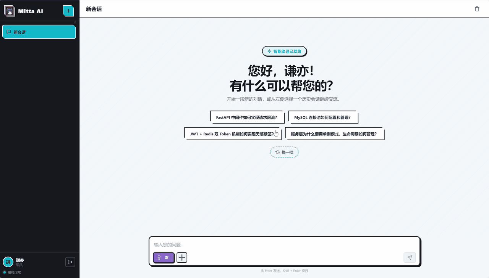
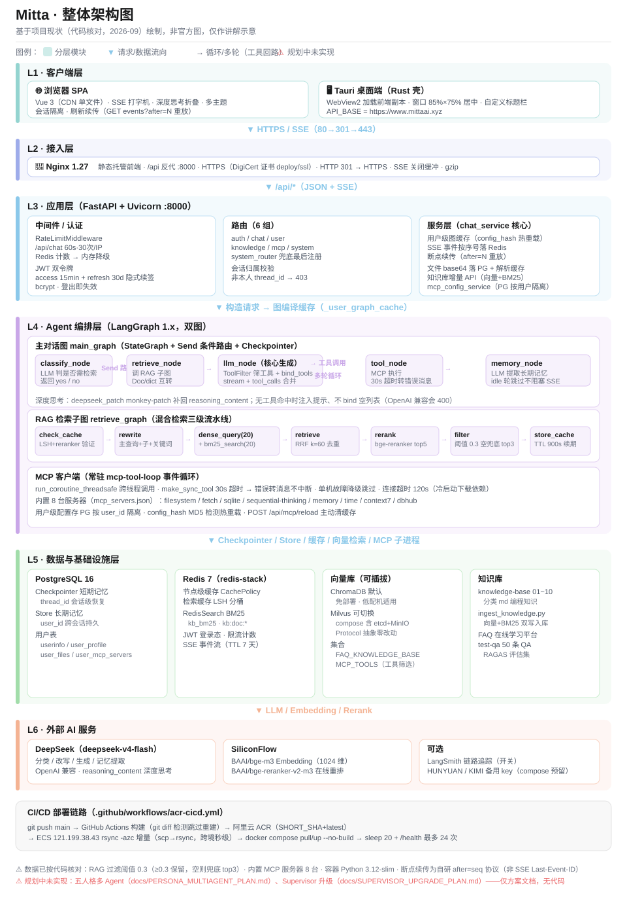
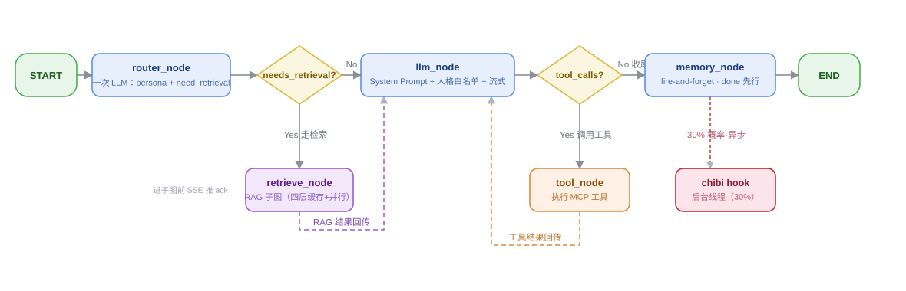
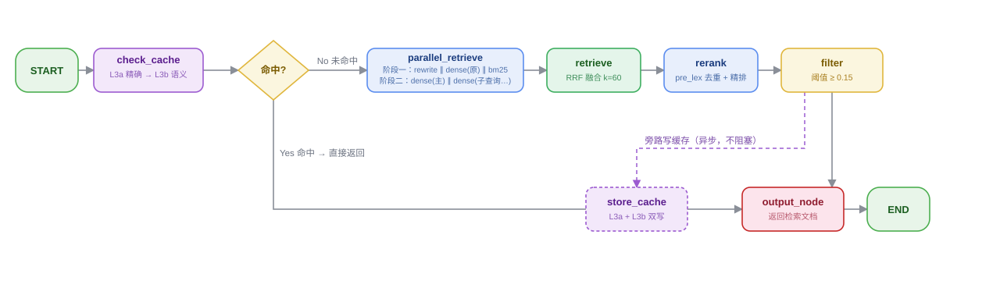
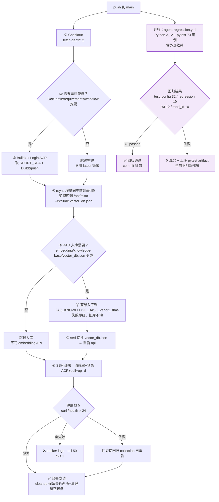

# Mitta AI 智能助理（米塔）

基于 **LangGraph + RAG + MCP + 流式 SSE** 的智能助理系统。系统内置完整的知识库检索链路（查询改写 → 多路召回 → RRF 融合 → 在线重排），支持短期记忆（多轮对话恢复）与长期记忆（用户档案），通过 MCP 协议接入外部工具（文件系统、数据库、网页抓取、时间服务等），并通过 SSE 流式输出实现打字机效果。

## UI演示




## 功能特性

- **统一意图路由**：`router_node` 一次 LLM 调用同时输出 `{persona, need_retrieval}`，按需走检索链路，避免无谓延迟；闲聊/自我介绍命中正则时直接短路、跳过 LLM 调用，进一步压低首 token 延迟
- **多人格路由层**：4 个对话人格（帽子 cappie 默认 / 善良 kind / 疯狂 crazy / 短发 manager）由每轮 `router_node` 分发；前端手选时 persona 直接用用户值（同一次调用只判 need_retrieval）；人格 prompt 无条件叠加进 System Prompt（语气层，不推翻事实层）；**按人格配置工具白名单**（善良 23 个纯只读 / 短发加 git 只读 4 个 / 疯狂零工具走裸模型分支）；配 chibi 袖珍分身概率性后置吐槽（30%，SSE 独立事件不进主消息流）
- **RAG 增强检索**：查询改写（主查询 + 子查询）→ 稠密向量多路召回 + BM25 稀疏检索（RedisSearch）→ RRF 融合去重 → SiliconFlow 在线重排 → 相关性阈值过滤
- **MCP 工具集成**：通过 Model Context Protocol 接入 filesystem、sqlite、sequential-thinking、memory、time、context7、dbhub 等外部工具，并自研本地 **mitta-tools**（git 操作/网络搜索/文件检索，12 个工具）；工具常驻事件循环，支持故障降级；**分组 + 分级启动**：第一方 6 台常驻、第三方 context7/dbhub 懒加载（`McpLazyLoader` 闪连预热 schema → 命中触发真实连接 → `DynamicToolNode` 动态路由），节省 150-300MB 内存
- **智能工具筛选**：规则层（tags 关键词命中）+ 语义层（向量检索）并集，每轮只暴露相关工具给 LLM，避免工具过多导致注意力稀释
- **双通道记忆**：
  - 短期记忆：PostgresSaver 按 `thread_id` 恢复多轮对话
  - 长期记忆：PostgresStore 按 `user_id` 保存用户档案（跨会话生效），提取在节点内 daemon 线程 fire-and-forget，不阻塞 SSE 收尾
- **用户自定义 System Prompt**：支持用户在个人信息界面上传自定义设定文件，与默认 Prompt 合并后作用于全局
- **文件上传与解析**：支持上传多种格式文件，上传后立即解析文本内容，发送消息时与用户输入一并送入 LLM
- **知识库增量更新 API**：通过 HTTP 接口向知识库增量上传文档（Chroma 向量 + RedisSearch BM25 双通道自动入库），支持文档列表查询、按来源/按文档删除，无需登录服务器跑脚本
- **流式输出**：`stream_mode=["messages","custom"]` 逐 token 输出，前端打字机效果；工具调用时实时显示加载状态；检索期 ack 预响应：`retrieve_node` 检索前推开场白（按人格 `ACK_OPENINGS`），助手气泡 0 延迟出现 + ragThinking 指示器，首 token 到达即移除
- **断点续传（刷新不中断）**：聊天任务与 SSE 连接解耦，每个思考/工具/正文事件按序号落 Redis List（TTL 7 天）；前端刷新或重连时先 `GET events?after=已消费序号` 重放缺失的增量事件重建界面，再续推新事件，强刷也能恢复思考过程与流式输出，且不会因重发而重复累积对话
- **用户级 MCP 热重载**：MCP 配置存 PostgreSQL 按用户隔离，网页端保存后通过 hash 检测自动重建对话图，`POST /api/mcp/reload` 主动清除缓存立即生效，无需重启后端
- **深度思考**：DeepSeek reasoning_content 流式输出，前端可切换思考开关与推理强度（low/medium/high），思考过程可折叠展开
- **轻量前端**：Vue 3 运行时（CDN 引入 `vue.global.prod.js`，**无构建工具 / 无 SFC / 无 package.json**，原生 JS + 模板字符串驱动），多主题 + 响应式移动端 + 高对比几何切角动效，工具调用记录穿插展示、复制/分享/重新生成；聊天区跳底悬浮按钮（距底 >200px 显示）+ 人格工具范围提示
- **安全认证**：JWT（access 15 分钟 + 隐式 refresh 30 天自动续签）+ bcrypt + 登出即时失效（Redis 删除 token）+ 请求限流
- **节点级缓存**：LangGraph CachePolicy + Redis，memory_node 结果按 TTL 缓存（retrieve/tool 节点缓存已移除，原因见「核心设计说明 → 节点级缓存」）

## 技术栈

| 层次        | 技术                                                                                                        |
| --------- | --------------------------------------------------------------------------------------------------------- |
| 语言/环境     | Python 3.12（容器 `python:3.12-slim`，AI 生态兼容性最好；本地开发可用 3.12+）                                                |
| Agent 编排  | LangGraph 1.x（StateGraph / Send 条件路由 / CachePolicy / Checkpointer / Store）                                |
| LLM 框架    | LangChain 1.x / langchain-openai / langchain-mcp-adapters                                                 |
| 大模型       | DeepSeek（deepseek-v4-flash），OpenAI 兼容协议，支持 reasoning_content 深度思考                                         |
| Embedding | SiliconFlow `BAAI/bge-m3`（1024 维）                                                                         |
| 重排        | SiliconFlow `BAAI/bge-reranker-v2-m3` 在线重排                                                                |
| 向量库       | ChromaDB（默认，免部署）/ Milvus（可插拔，Protocol 抽象，零业务改动切换）                                                         |
| 关系数据库     | PostgreSQL 16（LangGraph Checkpointer/Store + 用户表 userinfo / user_profile / user_files / user_mcp_servers） |
| 缓存        | Redis 7（节点级缓存 + 检索缓存 LSH + JWT 登录态 + 限流计数 + RedisSearch BM25 全文索引）                                        |
| MCP       | MCP Python SDK + FastMCP（内置 agent_server + 外部 stdio/sse 服务器连接）                                            |
| Web 框架    | FastAPI + Uvicorn（SSE 流式响应）                                                                               |
| 前端        | Vue 3 运行时（CDN `vue.global.prod.js`，**无构建工具 / 无 SFC / 无 package.json**）+ 手写设计系统 + 多主题 + 响应式移动端                                                      |
| 反向代理      | Nginx（静态托管 + API 代理 + SSE 缓冲关闭）                                                                           |
| 认证        | JWT（PyJWT）+ bcrypt 密码哈希                                                                                   |
| 可观测性      | LangSmith 链路追踪（可选）+ Loguru 结构化日志                                                                          |

## 系统架构

### 整体架构

<p align="center">
  
  <br/>
  <em>整体架构图（点击图片查看原图）</em>
</p>

### Mitta AI 流程图

## 1. 主对话图（main_graph）

<p align="center">
  
  <br/>
  <em>主对话图（点击图片查看原图）</em>
</p>

### 节点说明

| 节点                | 职责                | 关键实现                                                                                                                |
| ----------------- | ----------------- | ------------------------------------------------------------------------------------------------------------------- |
| **router_node** | 统一路由 | 一次 LLM 调用输出 `{persona, need_retrieval}`（`ROUTER_PROMPT`）；闲聊/自我介绍强模式短路 0 次 LLM；前端手选 `configurable.persona_override` 时 persona 直接采用、同调用只判 need_retrieval；解析失败兜底 persona=默认/手选、need_retrieval 保守 True |
| **retrieve_node** | 调用 RAG 子图检索知识库    | `retrieve_graph.invoke()`，Document 转 dict 存入 state（checkpoint 反序列化兼容）；进入子图前经 custom 通道推 ack 预响应开场白                                               |
| **llm_node**      | 核心生成节点            | 组装 System Prompt（默认+用户自定义+长期记忆+人格 prompt）→ ToolFilter 筛选工具 → 按人格白名单收缩 → `model.bind_tools()` → `model.stream()` → 合并 chunk 提取 tool_calls |
| **tool_node**     | 执行 MCP 工具         | LangGraph `ToolNode`，按工具名路由；CachePolicy 缓存同参数结果                                                                     |
| **memory_node**   | 提取长期记忆            | LLM 从对话中提取用户档案写入 PostgresStore；idle 闲聊轮快速跳过；非闲聊轮提取包进节点内 daemon 线程 fire-and-forget，节点立即返回、`done` 事件先行（详见「核心设计说明 → 记忆异步化」） |

### 条件路由

- **START → router_node**：统一路由（一次 LLM 出 persona + need_retrieval；闲聊/手选走短路），随后走条件边
- **router_node → route**：`needs_retrieval=True` 走检索链路，否则直接到 llm_node；快速短路命中时路由不做 LLM 调用直接 false
- **llm_node → route_after_llm**：`tool_calls` 非空走 tool_node，否则走 memory_node
- **tool_node → llm_node**：工具执行结果回到 LLM 生成最终回答（可多轮循环）

> **工具调用上限按轮计数**：防死循环的两道防线——单轮次数上限 `MAX_TOOL_ROUNDS=8` 与连续重复调用检测——均只统计本轮（从最后一条 `HumanMessage` 之后切片计数，用户发新消息即重新计数）。跨轮重复同一请求属用户重试，不判死循环。

---

## 2. RAG 检索子图（retrieve_graph）

<p align="center">
  
  <br/>
  <em>RAG 检索子图（点击图片查看原图）</em>
</p>

### 节点说明

| 节点                     | 职责                          | 关键实现                                                                                                                                            |
| ---------------------- | --------------------------- | ----------------------------------------------------------------------------------------------------------------------------------------------- |
| **check_cache**        | 检索缓存两级查找                    | 先 L3a 精确层 `query_exact_cache(question)`（文本 hash，0 embedding / 0 rerank），未命中再走 L3b 语义层 `query_cache(thread_id, question)`（LSH 分桶 + KNN + rerank 验证） |
| **parallel_retrieve**  | 并行编排（默认路径）        | 阶段一 `rewrite ∥ dense(原问题) ∥ bm25` 并发；阶段二 `dense(主查询) ∥ dense(子查询)` 并发；单路超时/失败只丢弃该路结果，不阻塞整体                                                        |
| **retrieve**           | RRF 融合 + 去重                 | Reciprocal Rank Fusion（k=60）融合稠密多路 + BM25，按 doc_id 去重、按文本去重；RRF 分写入 `metadata["rrf_score"]` 供 pre 阶段多样性去重当相关性信号                                |
| **rerank**             | 候选去重 + 在线重排 + 多样性选择         | `MMR_STAGE=pre_lex`（默认）：RRF 候选池先做词级 Jaccard 去重（44→20 篇）→ SiliconFlow `BAAI/bge-reranker-v2-m3` 精排 top_n=20 → 分数写入 `metadata["relevance_score"]`    |
| **filter**             | 相关性阈值过滤                     | 过滤 `relevance_score < 0.15` 的噪声文档；过滤后为空时兜底返回原始 top 3（宁可不准确也不返回空）                                                     |
| **store_cache**        | 写入 Redis（L3a + L3b 双写）      | L3a `rcache:x:{kb_ver}:{hash(问题)}`；L3b `retrieve_cache:{thread_id}:{bucket_id}`；动态 TTL 900s，命中自动续期                                              |

### 并行编排

**真实依赖**：`rewrite` 依赖 question + history；`dense(原问题)` 与 `bm25` 只依赖 question，**都不依赖改写**；只有 `dense(改写后各路)` 必须等 rewrite。

```
阶段一（并发）：rewrite  ∥  dense(原问题)  ∥  bm25
阶段二（并发）：dense(主查询) ∥ dense(子查询1) ∥ dense(子查询2)
阶段三（串行）：RRF 融合 → rerank → filter
```

**为什么用线程池而不是 LangGraph 并行边**：主图是同步 `invoke`（`chat_service` 里 `asyncio.to_thread(graph.invoke)`），
LangGraph 的**同步 superstep 对同一批无依赖节点是串行执行**的，只加边不加执行器不会变快
（要真并发得把节点改 async + 全链路换 `ainvoke`）。所以在单节点内用 `ThreadPoolExecutor` 扇出。

**降级策略**（任一路失败只丢弃该路，不抛异常）：

| 失败路             | 降级动作                          | 影响                     |
| --------------- | ----------------------------- | ---------------------- |
| rewrite 超时/异常   | `rewritten_queries = [原问题]`   | 退化为「原问题 + BM25」两路，仍出结果 |
| dense(任一路) 失败   | 该路贡献 0 条候选                    | 其余路不受影响                |
| bm25 失败         | 稀疏路为空                         | RedisSearch 不可用时常见     |
| 全部稠密路失败         | 只剩 BM25                       | 仍走 rerank/filter，不返回空  |

超时常量：改写 10s / 稠密 8s / BM25 3s。注意 Python 无法强制杀线程，超时是「不再等待该 future 的结果」。

**端到端实测**（21 条项目评测集，同一份数据同一环境）：

| 组合                 | 端到端均值     | p95        | 改写      | 稠密        | BM25   | 重排      | MMR     |
| ------------------ | --------- | ---------- | ------- | --------- | ------ | ------- | ------- |
| 串行基线（off）          | 4278.7 ms | 8294 ms    | 2226.0  | 1280.7    | 12.2   | 759.6   | 0       |
| 串行 + pre_lex（默认）   | 9749.2 ms | —          | 2286.4  | 6947.2 ⚠  | 14.1   | 426.7   | 74.6    |
| **并行（parallel+off）** | 6487.0 ms | 8582 ms    | —       | 5791.5 ⚠  | —      | 695.4   | 0       |

> ⚠ **读数口径**：本次 6 臂连跑期间，外部 embedding API 抖动剧烈——同一份数据、同一段代码，
> `dense_retrieve` 分项在 1280.7 ~ 9385.9 ms 之间跳变（6× 方差），而 `rewrite`（2226~2529 ms）
> 与 `rerank`（426~760 ms）始终稳定。因此**只有稳定性分项可信，含稠密项的端到端均值不可跨臂比较**。
> 并行臂结构收益的理论值约 960 ms（把 rewrite 与 dense(原问题)/bm25 重叠），远小于该抖动量级，
> 本次 A/B **未能验证也未能否定**并行收益，需在 API 稳定窗口重测。

**理论分解**（剔除抖动，仅按依赖关系推算）：

| 组合                  | 推算端到端     | 说明                                             |
| ------------------- | --------- | ---------------------------------------------- |
| 串行基线                | ~3.5 s    | rewrite 2.2s + dense 1.3s + bm25 0.01s         |
| 并行（重写与首路召回重叠）       | ~2.5 s    | max(rewrite 2.2s, dense 0.3s) + dense 0.3s，省 ~29% |
| 并行 + L1 改写缓存命中      | ~0.6 s    | 改写 0 ms，只剩两阶段稠密                                |
| **L3a 精确命中**（任意编排）  | **~1 ms** | 0 embedding / 0 rerank，直接返回                    |

> 补充事实：`ChromaVectorStore.query` **内部已用线程池并发**跑多条 query
> （`max_workers=min(len(query_texts),4)`），所以「4 路稠密」本身早就不是串行的，
> 并行的边际收益只来自「rewrite 与 dense(原问题)/bm25 的时间重叠」，不要按 4× 去估算。
> 生产环境保留 `RETRIEVE_PARALLEL_ENABLED=1` 默认开启，`=0` 一键回退串行对比。

### 关键参数

| 参数                     | 值                                                                                                                                   | 位置                                                                                       |
| ---------------------- | ----------------------------------------------------------------------------------------------------------------------------------- | ---------------------------------------------------------------------------------------- |
| 稠密召回 n_results        | 20/路（原问题 + 主查询 + 子查询，最多 4 路）                                                                                                        | `graphs/nodes/retrieve/parallel_nodes.py`                                                |
| BM25 召回 top_k         | 20                                                                                                                                  | `graphs/nodes/retrieve/query_nodes.py` `run_bm25`                                        |
| RRF_K                  | 60                                                                                                                                  | `constant/retrieval_constants.py`                                                        |
| 重排候选 top_n            | 20                                                                                                                                  | `constant/retrieval_constants.py` `MMR_TOP_CANDIDATES`                                   |
| **MMR 档位** `MMR_STAGE` | `pre_lex`（默认，rerank 前词级 Jaccard 去重 44→20）／`pre`（向量 MMR）／`post`（rerank 后，已证伪）／`off`                                                   | `constant/retrieval_constants.py`                                                        |
| MMR 词级去重阈值             | `MMR_LEXICAL_JACCARD=0.35`，`MMR_PRE_SELECT=20`                                                                                       | `constant/retrieval_constants.py`                                                        |
| MMR λ                  | `MMR_LAMBDA=0.5`（post）／`MMR_PRE_LAMBDA=0.7`（pre）                                                                                     | `constant/retrieval_constants.py`                                                        |
| 并行编排开关                 | `RETRIEVE_PARALLEL_ENABLED=1`（默认），`RETRIEVE_PARALLEL_WORKERS=4`                                                                       | `constant/retrieval_constants.py`                                                        |
| 单路超时                   | 改写 `REWRITE_TIMEOUT_SEC=10` / 稠密 `DENSE_TIMEOUT_SEC=8` / BM25 `SPARSE_TIMEOUT_SEC=3`                                                 | `constant/retrieval_constants.py`                                                        |
| 过滤阈值                   | 0.15（relevance_score ≥ 0.15，最多取 8 篇，空则兜底 top 3，常量 `RERANK_FILTER_THRESHOLD`）                              | `constant/retrieval_constants.py` + `graphs/nodes/retrieve/fusion_nodes.py` filter_node  |
| 缓存分层开关                 | `CACHE_LAYER_ENABLED=1`（默认）                                                                                                         | `constant/cache_constant.py`                                                             |
| 缓存 TTL                 | L1 改写 24h／L2 向量 7d／L3 检索结果动态 900s（命中续期）                                                                                             | `constant/cache_constant.py`                                                             |
| 缓存强命中阈值                | `CACHE_RERANK_STRONG_HIT=0.7`（两段式验证快通道）、`CACHE_RERANK_HIT_SCORE=0.5`、`CACHE_KNN_FAST_K=3`                                            | `constant/cache_constant.py`                                                             |
| 知识库版本键                 | `KB_VERSION=v1`（入库重灌即失效全部 L3a/L3b）                                                                                                   | `constant/cache_constant.py`                                                             |
| Embedding 模型           | BAAI/bge-m3（1024 维）                                                                                                                 | `constant/embedding_constants.py`                                                        |
| 切分 chunk               | 800 / overlap 100（chunks 270）                                                                                                       | `constant/embedding_constants.py`                                                        |
| 重排模型                   | BAAI/bge-reranker-v2-m3                                                                                                             | `init.py`                                                                                |
| BM25 索引名               | kb_bm25                                                                                                                             | `constant/cache_constant.py`                                                             |

### 混合检索设计思路

bge-m3 双编码器对中文技术查询区分度低（相关文档余弦相似度仅 0.4-0.6，排名 100+），而 BM25 对精确术语命中极高。两路互补：

- **稠密向量**：擅长语义相似（"如何避免默认参数陷阱" ≈ "可变默认参数的危害"）
- **BM25**：擅长精确关键词匹配（"可变默认参数""bcrypt""WebSocket" 直接命中）
- **RRF 融合**：只看排名不看绝对分数，统一两路量纲差异
- **rerank 精排**：交叉编码器对 query-doc 对做注意力计算，最终排序依据
- **阈值过滤**：用 rerank 分数（0~1）做统一过滤，0.15 以下视为噪声丢弃；过滤后为空时兜底返回原始 top 3，最多取 8 篇
- **多样性去重（`MMR_STAGE` 四档，定档 `pre_lex`）**：MMR 的位置比开关更重要，四档 A/B（21 条项目评测集，key_points 口径）如下：

  | 档位                    | boolean recall | kp 覆盖  | kp 全覆盖比 | 重排耗时     | 去重开销    | 送 rerank |
  | --------------------- | -------------- | ------ | ------- | -------- | ------- | ------- |
  | `off`                 | 0.8095         | 0.6833 | 0.4286  | 759.6 ms | 0       | 44.9    |
  | `pre` λ=0.5           | 0.8095         | 0.7119 | 0.4762  | 477.6 ms | 2180 ms | 20      |
  | `pre` λ=0.7           | 0.8095         | 0.6714 | 0.4286  | 449.9 ms | 4362 ms | 20      |
  | `post` λ=0.5          | **0.7143 ↓**   | 0.6833 | 0.4286  | 757.9 ms | 6217 ms | 44.0    |
  | **`pre_lex`（默认）**     | 0.8095         | 0.7119 | 0.4762  | **426.7** | **74.6** | 20      |

  结论：① `post`（rerank 后再多样性选篇）**是负收益**——recall 从 0.8095 掉到 0.7143，却多花 6217 ms，彻底证伪；
  ② 向量 `pre` 方向对（kp 覆盖 0.6833→0.7119）但花 2180 ms 只省 282 ms 重排，净亏 7.7×；
  ③ λ 调高反而变差（0.7119→0.6714），说明起作用的是**多样性项本身**，不是"少送几篇给 rerank"；
  ④ `pre_lex` 用 jieba 词级 Jaccard（阈值 0.35）近似多样性，**不需要额外 embedding**，
  拿到与 `pre` λ=0.5 相同的最佳质量，开销只有 74.6 ms（便宜 29×），重排 759.6→426.7 ms，**净省 ~258 ms 且质量更好**。

### 工具筛选机制

每轮对话时，`ToolFilter.select_tools(query, tools)` 执行两层筛选：

1. **规则层**：检查工具 `tags`（如 filesystem 工具含 `["文件","目录","读写"]`），query 中包含关键词即命中
2. **语义层**：将工具描述向量化存入向量库 `MCP_TOOLS` 集合，用 query 做语义检索，top_k=12
3. 两层结果按工具名去重并集，只把候选工具 `bind_tools` 给 LLM；无命中时注入"无工具可用"提示

### 记忆体系

| 类型      | 存储                      | 隔离维度              | 生命周期                        |
| ------- | ----------------------- | ----------------- | --------------------------- |
| 短期记忆    | PostgreSQL Checkpointer | thread_id         | 会话级，可恢复                     |
| 长期记忆    | PostgreSQL Store        | user_id           | 跨会话持久                       |
| 节点缓存    | Redis                   | 输入哈希              | TTL 10~900 秒                |
| 检索缓存 L1 改写 | Redis STRING（JSON）  | `rw:{prompt_ver}:{hash(问题‖历史)}` | TTL 24h（跨用户共享）        |
| 检索缓存 L2 向量 | Redis STRING（float32 二进制） | `emb:{model_tag}:{hash(文本)}` | TTL 7d（跨用户共享）      |
| 检索缓存 L3a 精确 | Redis STRING（JSON）   | `rcache:x:{kb_ver}:{hash(问题)}` | TTL 900s 命中续期（跨用户共享） |
| 检索缓存 L3b 语义 | Redis + LSH 分桶       | thread_id + bucket_id | TTL 900s 命中续期           |
| BM25 索引 | RedisSearch HASH        | doc_id            | 持久化，知识库重建时重建                |
| 登录态     | Redis                   | user_id           | access 15 分钟 / refresh 30 天 |

## 目录结构

```
AgentProject/
├── src/                                  # 后端源码
│   ├── main.py                           # FastAPI 入口：lifespan 资源管理 + 路由注册 + 全局异常
│   ├── init.py                           # 模型/Embedding/重排/System Prompt 初始化
│   ├── config.py                         # 环境变量加载/校验 + MCP/向量库配置文件管理
│   ├── constant/                         # 常量定义（按模块分类）
│   │   ├── cache_constant.py             # Redis 缓存/向量索引/Token key/节点 TTL
│   │   ├── embedding_constants.py        # 集合名/切分参数/模型名
│   │   ├── prompt_constants.py           # 记忆提取/意图分类提示词
│   │   ├── retrieval_constants.py        # TOP_K/距离阈值/RRF 参数/改写提示词
│   │   └── tool_constant.py              # 工具集合名/筛选 top_k/距离阈值
│   ├── context/
│   │   └── user_context.py               # CtxUser 请求级用户上下文
│   ├── graphs/                           # LangGraph 图定义
│   │   ├── main_graph.py                 # 主对话图：router→retrieve/llm→tool→memory
│   │   ├── retrieve_graph.py             # RAG 子图：cache→parallel_retrieve→rerank→filter
│   │   ├── tool_filter.py                # 工具筛选：规则层 + 语义层
│   │   └── nodes/
│   ├── mcp_client/                       # MCP 客户端
│   │   ├── client.py                     # MCP 连接管理/工具同步包装/故障降级/tags 注入
│   │   ├── mcp_tool_holder.py            # MCP 工具封装
│   │   ├── demo.py                       # MCP 调试示例
│   │   └── mcp_server/
│   │       ├── agent_server.py           # 内置 FastMCP 服务器（chat/get_user/summarize）
│   │       └── mitta_tools_server.py     # 本地实用工具集 FastMCP 服务器（git/搜索/文件，12 工具）
│   ├── middleware/
│   │   └── rate_limit_middleware.py      # 基于 Redis 的请求限流中间件
│   ├── agent_test/                       # Agent 系统评测（评测矩阵 E1–E15，见 docs/AGENT_EVAL_MATRIX.md）
│   │   ├── ragas_eval.py                 # RAGAS 五项指标评估（E8，LLM-as-judge，不进 CI）
│   │   ├── eval_routing.py               # 动态路由评测（E1：意图分类准确率/检索召回）
│   │   ├── evaluate_tool_filter.py       # 工具筛选规则层+语义层准确率评估（E2，22 条用例 recall 0.89）
│   │   ├── eval_tool_assembly.py         # 工具装配并集/降级/熔断评测（E3）
│   │   ├── eval_tool_safety.py           # MCP 安全校验评测（E4：命令/包名/env/sse 白名单）
│   │   ├── eval_tool_truncation.py       # 工具结果截断与异常兜底评测（E5）
│   │   ├── eval_semantic_cache.py        # 语义缓存命中质量评测（E6：同义命中/误命中）
│   │   ├── eval_retrieval.py             # 检索召回率/延迟评估（E7：单路 vs 混合，key_points 口径 + --diagnose）
│   │   ├── eval_ragas_judge.py             # 生成质量 LLM-judge 五指标（生产链路，21 条集实测）
│   │   ├── persona_router_eval.py          # 人格路由四分类评测（E15：已并入 E1 统一评测，报告冻结 LEGACY）
│   │   ├── eval_memory.py                # PostgresStore 读写延迟/重复写入减少/对话画像评估（E9，含生产容器内实测）
│   │   ├── eval_rate_limit.py            # 限流拦截准确率/降级耗时/并发压测（E10）
│   │   ├── eval_jwt.py                   # JWT 登录态校验耗时/token 自动续签成功率（E11）
│   │   ├── eval_sse.py                   # SSE 首 token 延迟/流纯净度评估（E12）
│   │   ├── eval_online.py                # 线上全链路实测（E13：health/登录/SSE/登出失效/限流 429）
│   │   ├── eval_cache.py                 # 缓存命中率/Embedding 调用降低/污染率评估
│   │   ├── eval_cache_ttl.py             # 固定 TTL vs 动态 TTL 命中率对比
│   │   └── *_report.json/csv             # 各评估脚本输出的报告
│   ├── routers/                          # FastAPI 路由（按模块拆分）
│   │   ├── deps.py                       # 公共依赖（require_self_or_admin）
│   │   ├── auth_router.py                # 登录/注册/密码找回/登出（Redis 即时失效）
│   │   ├── chat_router.py                # 对话(SSE)/历史/删除/停止/文件上传
│   │   ├── user_router.py                # 个人资料/密码/Prompt/主题/记忆/文件
│   │   ├── knowledge_router.py           # 知识库增量 API（upload/documents/delete）
│   │   ├── mcp_router.py                 # 用户级 MCP 配置读写 + 热重载（/api/mcp/reload）
│   │   └── system_router.py              # 健康检查/认证页面/SPA 兜底（必须最后注册）
│   ├── schemas/                          # Pydantic 请求/响应模型
│   │   ├── request_schemas/
│   │   │   ├── chat_schema.py            # ChatRequest（含 file_ids）
│   │   │   ├── login_schema.py
│   │   │   └── user_schema.py
│   │   └── response_schemas/
│   │       └── login_schema.py
│   ├── service/                          # 业务服务层
│   │   ├── chat_service.py               # 对话编排：用户级图缓存(hash热重载)/流式输出/文件解析缓存
│   │   ├── login_service.py              # 用户登录/注册（PostgreSQL 连接池）
│   │   ├── user_profile_service.py       # 用户扩展信息（头像/风格/Prompt/主题/MCP 配置）
│   │   ├── mcp_config_service.py         # 用户级 MCP 配置（PostgreSQL 存储，按用户隔离，安全校验+路径转换）
│   │   ├── file_upload_service.py        # 文件上传（base64 存 PostgreSQL）/文本解析
│   │   ├── knowledge_service.py          # 知识库增量服务（文档入库/列表/删除，向量+BM25 双通道）
│   │   └── cache_service.py              # Redis 缓存/LSH 向量检索/重排验证
│   ├── utils/                            # 工具函数
│   │   ├── jwt_utils.py                  # JWT 签发/验证/自动续签/登出失效/密码哈希
│   │   ├── response_util.py              # 统一响应格式
│   │   ├── doc_util.py                   # Document ↔ dict 转换
│   │   ├── lsh_util.py                   # 局部敏感哈希（缓存快速过滤）
│   │   ├── rand_id_util.py               # 随机 ID 生成
│   │   ├── tools_util.py                 # 工具安全过滤/向量化/格式化
│   │   └── deepseek_patch.py             # DeepSeek reasoning_content monkey-patch（补回 langchain_openai 丢失的思考内容）
│   └── vector/                           # 向量库抽象层
│       ├── vector_store.py               # VectorStore Protocol + Chroma/Milvus 实现
│       ├── embedding.py                  # EmbeddingProcessor：文档加载→切分→入库
│       └── retrieve_doc.py               # RetrievedDoc 数据结构
├── resources/
│   ├── config/
│   │   ├── vector_db.json                # 向量库配置（type/persist_path/collection）
│   │   ├── mcp_servers.json              # 全局默认 MCP 服务器配置（JSON 数组）
│   ├── frontend/
│   │   ├── index.html                    # Vue 3 CDN 入口（无构建）
│   │   ├── assets/css/style.css          # 设计系统（CSS 变量+切角+动效+响应式）
│   │   ├── assets/js/app.js              # Vue 组件+业务逻辑（模板字符串内嵌，setup/methods）
│   │   ├── deploy/nginx/default.conf     # Nginx 配置（静态托管+API代理+SSE缓冲关闭+gzip）
│   │   └── favicon.png
│   ├── system_prompt/
│   │   └── default_system_prompt.txt     # 默认 System Prompt（Mitta 角色设定）
│   ├── knowledge-base/                   # 编程知识库（Markdown）
│   │   ├── ingest_knowledge.py           # 知识库入库脚本（向量库 + RedisSearch BM25 双写；支持 --collection/--redis-url 覆盖，供 CI 蓝绿入库）
│   │   ├── cleanup_collections.py        # 清理旧 collection（--keep 显式保留活跃+上一版，删除其余 FAQ_KNOWLEDGE_BASE_*）
│   │   ├── 01~10-*.md                    # 分类知识文档
│   │   └── test-qa/                      # 测试 QA 集（eval_dataset.json 45 条 + eval_project_dataset.json 21 条）
│   ├── FAQ/                              # 在线学习平台 FAQ 知识库
│   └── chroma_db/                        # ChromaDB 持久化目录（Milvus 模式下不用）
├── tests/                                # 单元测试
├── docs/                                 # 项目文档（API.md / devlog / ci-flow.html / architecture-flowcharts.md）
├── scripts/                              # 运维脚本
│   └── migrate_mysql_to_pg.py            # 一次性数据迁移脚本（MySQL → PostgreSQL 存量用户数据）
├── .env.example                          # 环境变量模板
├── requirements.txt                      # Python 依赖
├── Dockerfile                            # 后端容器镜像
├── docker-compose.yml                    # 一键部署（PostgreSQL+Redis+API+Nginx，ChromaDB 免 Milvus）
└── README.md
```

## 快速开始

### 环境要求

- Python 3.12+（容器镜像为 3.12-slim；部分包暂无 3.13 wheel）
- PostgreSQL 16+
- Redis 7+
- 向量库：默认 ChromaDB（免部署，api 服务不硬依赖 Milvus）；如需 Milvus 2.x 另行部署
- Node.js（MCP stdio 服务器需要 npx/uvx）

### 1. 克隆项目并安装依赖

```bash
git clone https://github.com/Q1anyii/Mitta.git Mitta
cd Mitta
pip install -r requirements.txt
```

### 2. 配置环境变量

```bash
cp .env.example .env
```

编辑 `.env`，填写以下必填项：

| 变量                    | 说明                                       |
| --------------------- | ---------------------------------------- |
| `DEEPSEEK_API_KEY`    | DeepSeek API 密钥（主模型 + RAGAS 评判）          |
| `SILICONFLOW_API_KEY` | 硅基流动 API 密钥（Embedding + 重排）              |
| `POSTGRESQL_DB_URL`   | PostgreSQL 连接串（Checkpointer/Store + 用户表） |
| `REDIS_DB_URL`        | Redis 连接串                                |
| `JWT_SECRET_KEY`      | JWT 签名密钥（随机强密钥）                          |

### 3. 启动基础设施

```bash
# api 核心依赖：PostgreSQL + Redis
docker-compose up -d postgres redis
# 如需 Milvus 向量库（可选）：
docker-compose up -d etcd minio milvus
```

或手动启动各服务。PostgreSQL 需创建数据库 `agentproject`（表由服务启动时自动创建，用户表 userinfo / user_profile / user_files 亦由各服务自动建表）。**低配服务器（<2GB 内存）推荐使用 ChromaDB 免 Milvus 部署**，见下方向量库配置。

### 4. 配置向量库

编辑 `resources/config/vector_db.json`：

```json
{
  "type": "chroma",
  "persist_path": "resources/chroma_db",
  "collection": "FAQ_KNOWLEDGE_BASE"
}
```

> 注意：`persist_path` 使用相对路径，容器内（WORKDIR `/app`）与本地项目根目录均可正确解析到各自的 `chroma_db` 目录。

如使用 Milvus（需自行部署），改为：

```json
{
  "type": "milvus",
  "uri": "http://localhost:19530",
  "collection": "FAQ_KNOWLEDGE_BASE"
}
```

### 5. 配置 MCP 服务器（网页端，推荐）

登录后在「设置 → MCP 配置」中直接编辑 JSON 并保存，配置存入 PostgreSQL 按用户隔离，**保存后自动热重载生效，无需重启后端**。后端通过配置 hash 检测自动重建对话图，`POST /api/mcp/reload` 可主动清除缓存立即生效。

全局默认 MCP 服务器仍可通过 `resources/config/mcp_servers.json` 配置（启动时加载，所有用户共享）。示例：

```json
[
  {
    "name": "filesystem",
    "type": "stdio",
    "command": "npx",
    "args": ["-y", "@modelcontextprotocol/server-filesystem", "/app/user_files"]
  }
]
```

不配置 MCP 不影响核心对话功能。安全校验：命令白名单（npx/uvx/node/python/python3/pipx）、Windows 路径自动转换为 Linux 容器路径、filesystem 限制在 `/app/user_files/{user_id}/` 下。

#### 系统默认 MCP 服务器

项目内置 8 台开箱即用的 MCP 服务器（`resources/config/mcp_servers.json`，启动时加载、所有用户共享），覆盖内容获取、数据存储、记忆推理与基础工具四类能力：

| 服务器                 | 启动方式                                                   | 作用                                              |
| ------------------- | ------------------------------------------------------ | ----------------------------------------------- |
| filesystem          | `npx @modelcontextprotocol/server-filesystem`          | 文件系统读写：列目录、读/写/搜索文件、创建文件夹，访问范围限定项目目录            |
| mittatools          | `python src/mcp_client/mcp_server/mitta_tools_server.py`（cwd=`/app`） | 本地实用工具集：Bing 搜索（无 key）/网页抓取/git 系列/文件搜索与安全读取/项目结构 |
| sqlite              | `uvx mcp-server-sqlite`                                | SQLite 操作：执行 SQL 查询/写入，数据存于项目内 `local_data.db`  |
| sequential-thinking | `npx @modelcontextprotocol/server-sequential-thinking` | 分步推理：强制模型逐步思考（拆解问题、验证假设），适合排错与复杂分析              |
| memory              | `npx @modelcontextprotocol/server-memory`              | 知识图谱记忆：以实体/关系形式长期存储用户信息，跨会话记住用户偏好               |
| time                | `uvx mcp-server-time`                                  | 时间服务：获取当前时间、时区换算、日期计算                           |
| context7            | `npx @upstash/context7-mcp`                            | 最新技术文档检索：拉取 API / SDK 官方文档（含版本、参数）              |
| dbhub               | `npx @bytebase/dbhub --demo`                           | 数据库交互（当前 demo 模式）：连接 MySQL/Postgres 执行 SQL、查表结构 |

能力分工：**filesystem / mittatools / context7** 负责获取内容（网页抓取由 mittatools 的 `fetch_url` 承接，原 `fetch` 因仅兼容 OpenAI MCP 客户端已移除），**sqlite / dbhub** 负责存储与查询，**memory / sequential-thinking** 负责记忆与推理，**time** 提供基础工具。删除某项只需从 `mcp_servers.json` 移除对应条目，无需改动代码。Dockerfile 额外内置 `@modelcontextprotocol/server-github` 等 npm 包，供用户级 MCP 配置按需启用。

> **配置注意**：`mittatools` 的 `cwd` 必须是镜像代码根 `/app`。若指向容器内被自动建出的空目录（如 `/app/user_files/user_01/AgentProject`），`client.py` 的脚本预检会失败 → 该 server 被静默跳过、12 个工具线上全部缺失，而服务与健康检查一切正常。`npx`/`uvx` 类服务器 `args[0]` 是包名、不走脚本预检，不受影响。改完配置请实际验证工具数，不要只看服务启动成功。

### 6. 知识库入库（可选）

入库脚本同时写入向量库（向量索引）和 RedisSearch（BM25 全文索引），两者用相同 doc_id 对齐，RRF 融合时靠 id 匹配。

**方式一：脚本全量入库**（初次建库推荐）

```bash
cd src
python ../resources/knowledge-base/ingest_knowledge.py
# 蓝绿入库到指定 collection（CI 用）：--collection FAQ_KNOWLEDGE_BASE_<short_sha> --redis-url redis://redis:6379/0
```

**方式二：HTTP 接口增量入库**（日常维护推荐，无需登录服务器）

| 方法     | 路径                                  | 说明                                  |
| ------ | ----------------------------------- | ----------------------------------- |
| POST   | `/api/knowledge/upload`             | 上传文档入库（.md/.txt/.pdf，≤10MB，双通道自动写入） |
| GET    | `/api/knowledge/documents`          | 列出知识库全部文档（按来源聚合，含 chunk 数）          |
| DELETE | `/api/knowledge/source/{source}`    | 删除指定来源文件的全部 chunk                   |
| DELETE | `/api/knowledge/documents/{doc_id}` | 删除单个文档 chunk                        |

```bash
# 示例：增量上传一篇文档（需 JWT）
curl -X POST http://localhost:8000/api/knowledge/upload \
  -H "Authorization: Bearer <token>" \
  -F "file=@docs/new-article.md"
```

重复上传同一文档时基于内容哈希生成 doc_id 自动覆盖更新，不产生重复；BM25 索引自动覆盖新写入的 `kb:doc:*` 哈希，无需重建。

**方式三：CI 蓝绿自动入库**（见「CI/CD 蓝绿入库切换」）——push 到 main 且改动命中 `src/constant/embedding_constants.py` / `resources/knowledge-base/` / `resources/config/vector_db.json` 时，Actions 自动入库到新 collection `FAQ_KNOWLEDGE_BASE_<short_sha>` → 切换 vector_db.json → 重启 → 健康检查通过后保留最近两个 collection（`cleanup_collections.py --keep`），失败自动回滚旧 collection。**绝不先删旧库**。

### 7. 启动后端

```bash
cd src
uvicorn main:app --host 0.0.0.0 --port 8000 --reload
```

### 8. 启动前端（Nginx）

将 `resources/frontend/nginx.conf` 复制到 Nginx 配置目录，修改 `root` 路径指向 `resources/frontend/`，然后：

```bash
nginx
# 或 nginx -s reload
```

访问 `http://localhost` 即可使用。开发阶段也可直接访问 `http://localhost:8000`（后端托管 SPA）。

## API 接口一览

> 完整的请求/响应示例、错误码说明、SSE 事件格式见 [docs/API.md](docs/API.md)。

### 认证

| 方法   | 路径              | 说明                                      |
| ---- | --------------- | --------------------------------------- |
| POST | `/api/login`    | 用户登录（返回 access token，refresh 隐式存 Redis） |
| POST | `/api/register` | 用户注册                                    |
| POST | `/api/recover`  | 密码找回                                    |
| POST | `/api/logout`   | 登出（Redis 删除 access+refresh，即时失效）        |

### 对话

| 方法     | 路径                              | 说明                         |
| ------ | ------------------------------- | -------------------------- |
| POST   | `/api/chat/`                    | 发送消息（SSE 流式响应，支持 file_ids） |
| GET    | `/api/chat/{thread_id}/history` | 获取会话历史                     |
| DELETE | `/api/chat/{thread_id}`         | 删除会话                       |
| POST   | `/api/chat/stop`                | 停止回复                       |
| POST   | `/api/chat/upload`              | 上传文件（保存后立即解析文本）            |
| DELETE | `/api/files/{file_id}`          | 删除已上传文件                    |

### 用户

| 方法      | 路径                                   | 说明                     |
| ------- | ------------------------------------ | ---------------------- |
| GET     | `/api/users/{user_id}/profile`       | 获取个人信息                 |
| PUT     | `/api/users/{user_id}/profile`       | 更新个人信息（用户名/头像/风格）      |
| PUT     | `/api/users/{user_id}/password`      | 修改密码                   |
| GET/PUT | `/api/users/{user_id}/system-prompt` | 获取/更新自定义 System Prompt |
| GET/PUT | `/api/users/{user_id}/theme`         | 获取/更新前端主题              |
| GET     | `/api/users/{user_id}/memory`        | 获取长期记忆                 |
| GET     | `/api/users/{user_id}/sessions`      | 获取会话列表                 |
| GET     | `/api/users/{user_id}/files`         | 获取已上传文件列表              |
| GET/PUT | `/api/users/{user_id}/mcp`           | 获取/更新用户级 MCP 配置        |

### MCP / 系统

| 方法      | 路径                              | 说明                              |
| ------- | ------------------------------- | ------------------------------- |
| GET/PUT | `/api/mcp/config`               | 当前用户 MCP 配置读写（PostgreSQL 按用户隔离） |
| POST    | `/api/mcp/reload`               | 重载当前用户 MCP 配置（清除图缓存+关闭旧连接，立即生效） |
| DELETE  | `/api/mcp/config/{server_name}` | 删除单个 MCP 服务器配置                  |
| GET     | `/health`                       | 健康检查                            |
| GET     | `/mcp`                          | 内置 MCP 服务器端点（FastMCP）           |

### 知识库

| 方法     | 路径                                  | 说明                            |
| ------ | ----------------------------------- | ----------------------------- |
| POST   | `/api/knowledge/upload`             | 上传文档增量入库（.md/.txt/.pdf，双通道写入） |
| GET    | `/api/knowledge/documents`          | 知识库文档列表（按来源聚合，含总 chunk 数）     |
| DELETE | `/api/knowledge/source/{source}`    | 按来源删除全部 chunk                 |
| DELETE | `/api/knowledge/documents/{doc_id}` | 按 doc_id 删除单个 chunk           |

## 核心设计说明

### MCP 工具常驻事件循环

MCP 工具通过 `langchain_mcp_adapters` 加载为 async 工具，闭包捕获绑定创建时事件循环的 `ClientSession`。同步图（ToolNode）在线程池执行时会临时新建事件循环，跨循环调用 session 会失败/挂起（Windows 下 mcp 库 cancel scope 泄漏还会注入 CancelledError 中断整图）。解决方案：

- 启动时创建专用守护线程运行独立事件循环（`mcp-tool-loop`），MCP 连接建立与工具调用全部提交到该循环（`asyncio.run_coroutine_threadsafe`）
- `make_sync_tool` 将 async 工具包装为同步 StructuredTool，含 30 秒调用超时，超时由 ToolNode 转错误消息，不中断对话链路
- 单个 MCP 服务器连接失败不影响其他服务器（120 秒连接超时 + 故障降级跳过；冷启动时 uvx/npx 首次需下载依赖，超时过短易导致全部服务器被跳过，故取较大值）
- MCP 工具按服务器名注入 tags（`SERVER_TAGS` 映射）、按工具名注入精准 tags（`TOOL_TAGS`），供工具筛选规则层命中并按强弱排序
- 关闭时按序在工具循环内释放 MCP 子进程连接，避免资源泄漏

### 已知故障模式与排查要点

线上出现过两类「工具在但不可用」的故障，排查的关键区分是**「工具不在」还是「工具在但坏了」**：

| 现象 | 根因 | 排查入口 | 处置 |
| --- | --- | --- | --- |
| 模型答「没有网页抓取工具」 | `mcp_servers.json` 里 `cwd` 指向空目录，`client.py` 脚本预检失败 → 整个 server 被 warning 跳过（工具全缺） | 启动日志搜 `MCP 服务器脚本不存在`；核对实际注册工具数 | `cwd` 改镜像代码根 `/app`；只改挂载配置，CI rsync 同步 + 重启 api 即可 |
| 模型答「抓取组件缺少依赖模块 `No module named 'bs4'`」 | 延迟 import 的可选依赖未列入 `requirements.txt`；server 启动正常、工具照常注册，只有真调用才报错 | 健康检查看不出问题；需直连工具函数试调一次 | `requirements.txt` 补依赖 → **必须 CI 重建镜像**才生效 |

> 延迟 import 的可选依赖目前没有启动期校验，只靠 `requirements.txt` 注释提醒；如需彻底防复发，可在 `main.py` lifespan 里对可选依赖做 try import 并暴露到 `/health`。

### 智能工具筛选

每轮对话时，`ToolFilter.select_tools(query, tools)` 执行两层筛选并集，只把候选工具暴露给 LLM：

1. **规则层**：检查工具 `tags`（如 filesystem 工具含 `["文件","目录","读写","file"]`），query 中包含关键词即命中，零延迟
2. **语义层**：工具描述向量化存入向量库 `MCP_TOOLS` 集合，用 query 做语义检索（top_k=12，距离阈值 0.6），失败自动熔断降级为纯规则层
3. 两层结果按工具名去重并集；无命中时不 bind 空列表（OpenAI 兼容 API 会 400），改用裸模型并注入"无工具可用"提示
4. 多轮指代增强：输入含"继续/刚才/那个"等指代词时，拼接最近一轮 AI 回复前 200 字符辅助筛选

### 节点级缓存（LangGraph CachePolicy + Redis）

> 注：retrieve_node 和 tool_node 缓存已删除，原因：
>
> 1. 子图 retrieve_graph 内置缓存机制，外层设置缓存目的减少一次子图创建，后续可把子图缓存机制抽出
> 2. tool_node 的缓存 key 不带 tool_call_id，若缓存复用影响 ToolMessage 导致工具调用失败

LangGraph `CachePolicy` 配合 `RedisCache`，在图编译时注入，节点结果按 TTL 缓存到 Redis：

| 节点          | 缓存键                                    | TTL | 策略                |
| ----------- | -------------------------------------- | --- | ----------------- |
| memory_node | 消息轮次+输入+AI回复（仅 executed/unavailable 轮） | 10s | idle 闲聊轮返回随机键永不命中 |

缓存键自定义设计：默认 key_func 对节点输入整体 pickle 哈希，而 Send payload 含每轮变化的 messages，会导致缓存键每轮都变、永不命中。自定义 key_func 只取稳定部分（用户输入/工具参数），确保缓存可命中。

### 检索缓存四层（CacheService + Redis Search + LSH）

除 LangGraph 节点级缓存外，`CacheService` 基于 Redis 构建了**四层缓存**。原实现只有一层「检索结果语义缓存」，
问题在于它**每次命中都要先跑一次 embedding** 才能查 LSH 桶——省下的只是重排和召回，embedding 开销一分没省，
延迟收益被砍半、embedding 调用成本完全没降。因此按「谁依赖谁」拆成四层，让每一层单独可命中：

| 层            | 缓存内容          | 缓存键                                                    | 命中条件                                    | 跨用户共享         | TTL          |
| ------------ | ------------- | ------------------------------------------------------ | --------------------------------------- | ------------ | ------------ |
| **L1 改写**    | LLM 查询改写结果    | `rw:{prompt_ver}:{sha256(norm(问题)‖norm(历史))[:32]}`     | 归一化后问题+历史完全相同                           | ✅ 全局共享（不含用户态） | 24h          |
| **L2 向量**    | bge-m3 文本向量   | `emb:{model_tag}:{sha256(norm(文本))[:32]}`              | 归一化后文本完全相同                              | ✅ 全局共享       | 7d           |
| **L3a 精确结果** | 完整检索结果（含重排分）  | `rcache:x:{kb_ver}:{sha256(norm(问题))[:32]}`            | 归一化后问题完全一致                              | ✅ 全局共享       | 900s（命中续期）   |
| **L3b 语义结果** | 完整检索结果（含重排分）  | `retrieve_cache:{thread_id}:{bucket_id}`（LSH 分桶）       | LSH 桶内 + rerank ≥ 0.5                   | ❌ 按会话隔离      | 900s（命中续期）   |

**归一化**（决定 L1/L2/L3a 能否跨用户）：全角空格→半角、trim、连续空白折叠为单空格、ASCII 转小写。
`"Redis  是什么？"`、`"Redis 是什么？ "`、`"redis 是什么？"` 三个写法会落到同一个 key。

**为什么 L3b 不能省掉 rerank**：bge-m3 原始 query 向量对短问题区分度差（正是项目要上 rerank 的原因），
只用向量 KNN 会把「怎么部署」和「怎么回滚」判成一条。所以 L3b 的 rerank **是命中判据本身，不是可选优化**，
真正能省掉 rerank 的是 L3a（文本 hash 精确匹配，无需任何语义判断）。

**L3b 两段式验证**：先取 KNN 近邻 top `CACHE_KNN_FAST_K=3` 精排，
分数 ≥ `CACHE_RERANK_STRONG_HIT=0.7` 直接判命中（强命中快通道，绝大多数命中走这条）；
否则才把整个桶的候选全量精排，≥ `CACHE_RERANK_HIT_SCORE=0.5` 判命中。未命中一律走完整 RAG。

**失效策略**：

| 变更                          | 失效范围                                     |
| --------------------------- | ---------------------------------------- |
| 知识库重灌/切 chunk             | `MITTA_KB_VERSION` 自增 → L3a、L3b **全部**失效 |
| 改写 prompt 改版                | `MITTA_REWRITE_PROMPT_VER` 自增 → L1 全失效   |
| 换 embedding 模型              | L2 key 自带 `model_tag`，新旧并存不串味，老条目自然过期    |
| 时间                          | L1 24h / L2 7d / L3 900s 动态续期            |

> 已知限制：L3a 是跨会话共享的，而 `clear_thread_cache` 目前按 thread 清理，会误删本可共享的条目，需改为按 key 清理。

**各层实际收益**（本地 redis-stack 实测 / 分项推算）：

| 层   | 命中后省掉什么                           | 实测/推算收益                                       |
| --- | --------------------------------- | --------------------------------------------- |
| L1  | 一次 LLM 改写调用                       | 改写分项 2226 ms → ~0 ms（重复提问场景）                  |
| L2  | 一次 embedding 调用                   | **首次 469 ms → 二次 2 ms**（同文本，1024 维，向量逐位一致）    |
| L3a | embedding + 4 路召回 + RRF + 重排，**全链路** | **~1 ms**（0 embedding / 0 rerank，直接反序列化返回） |
| L3b | 4 路召回 + RRF + 部分重排                | 高并发下把整条 RAG 流水线降到「1 次 embedding + 3 条候选重排」   |

**降级策略**：Redis 不可用（或 `CACHE_LAYER_ENABLED=0`）时静默降级为不缓存，不阻塞检索主链路。
⚠ 部署注意：Windows 下 Redis 必须用 `127.0.0.1` 而非 `localhost`——`localhost` 会解析到 IPv6 `::1`，
而 redis-stack 只监听 IPv4，报错 10054 后 **BM25 会静默退化为空召回**（不抛异常，极难发现）。**2026-09-22 修复（19da33f）**：入库脚本 ingest_knowledge.py Step4 原本只 HSET 写内容、漏调 cache_service.create_sparse_index()，导致 RediSearch 上根本没有 kb_bm25 索引、FT.SEARCH 恒空；补一行幂等建索引后稀疏路从恒空恢复为正常召回，双路互补真实成立。

### 流式输出与工具调用状态

- 使用 `stream_mode=["messages", "custom"]` 捕获图中所有 LLM token 事件与自定义事件；按 `meta["langgraph_node"]` 过滤只输出 llm_node 的增量，custom 通道承载 `retrieve_node` 的 ack 预响应结构化 dict
- SSE 事件类型：`content`（文本 token）、`ack`（检索期开场白预响应，见下）、`tool_call_start`（工具名+参数）、`tool_call_end`（工具名+结果摘要）、`done`（正文流完，只推送不落库，前端立即解锁发送）、`chibi`（袖珍分身吐槽，后台线程异步发送，见「记忆异步化」）、`error`（异常）、`[DONE]`（结束）
- 前端监听 `tool_call_start/end` 事件，在 AI 消息下方显示"正在调用工具：xxx"加载条
- 流式模式下 tool_calls 分块传输，通过 `AIMessageChunk.__add__` 合并所有 chunk 提取完整工具调用，避免取最后一个 chunk 导致 tool_calls 为空

### 检索期 ack 预响应

`retrieve_node` 在进入 `retrieve_graph.invoke` **之前**，通过 `from langgraph.config import get_stream_writer` 向 custom 通道推送 `{"ack": text, "persona": persona}`（0 LLM 调用；writer 不可用静默降级）。文案来自 `src/constant/ack_constant.py` 的 `ACK_OPENINGS`（按 persona crazy/kind/cappie 分组 + `DEFAULT_ACK`），`pick_ack_text(persona)` 选取。前端 `onAck` 把开场白立即作为助手消息初始值（检索期间助手气泡 0 延迟出现）+ `ragThinking` 指示器，首个正文 token 到达后移除。断点重放 `_applyEventsToMsg` 也处理 `ev.ack`，刷新后开场白与正文连贯不拆条。

### 记忆异步化

`memory_node` **保留在主图内**（`route_after_llm` 无 tool_calls 仍走它），但真正需要提取的轮次，把「读 store 档案 → LLM 提取/合并 → 用户名行正则兜底 → store.put」整体包进内联 `_extract_and_persist()`，用 `threading.Thread(target=..., daemon=True).start()` 后台执行后**节点立即返回**——`graph.stream` 随即结束、`done` 事件先行，长期记忆 LLM 提取（1~3s）不再压在图流末尾阻塞收尾。chibi 同步改为 `_chibi_async` 后台线程，SENTINEL 移入该线程 finally，保证 `[DONE]` 在 chibi 事件后发出。

### 文件上传与解析

1. 前端上传文件 → `POST /api/chat/upload` → 保存到 PostgreSQL `user_files` 表（base64 编码，单文件上限 10MB）
2. 保存后立即调用 `chat_service.parse_and_cache_file()` 解析文本（阻塞执行，接口返回即解析完成）
3. 解析结果缓存到内存 `_file_content_cache`（key=`{user_id}:{file_id}`），避免重复解析
4. 发送消息时前端传 `file_ids` → 后端从缓存读取文件内容 → 以"【文件名】+内容"格式拼接到 `input_str` → 传入 LLM
5. 支持 txt/md/csv/json/py/js 等纯文本格式（UTF-8/GBK 编码兼容）；PDF 使用 PyPDFLoader 解析；不支持的格式返回 `parsed=false`
6. 删除文件时同步清除解析缓存

### 安全设计

- JWT access token 15 分钟过期，Redis 存 refresh token 30 天，后端在 token 过期时自动续签（对前端透明）
- 密码使用 bcrypt 哈希（截断 72 字节，bcrypt 上限）
- `/api/chat/` 接口限流：每 IP 60 秒 30 次（Redis 计数器，Redis 不可用时降级内存限流）
- MCP 配置文件路径白名单校验（仅允许项目 resources/、config/ 和用户主目录），防止写入系统敏感目录
- 会话归属校验：非本人 thread_id 返回 403，防止会话劫持
- 全局异常处理器：记录完整堆栈到日志，返回给客户端的信息不含堆栈细节
- MCP 文件系统工具通过 allowed directories 限制访问范围（
ead_local_file 做 Path.resolve() 前缀校验，防 ../ 目录穿越）

### 安全加固（2026-09-22 一批 A1–A11）

- **认证端点独立限流**：/api/login、/api/recover/* 按 IP + userId 双维度计数，失败累加 + 指数退避，成功清零；与聊天主限流互不影响
- **密码找回改一次性验证码**：原"仅凭 user_id + 新密码"可接管账号；现 Redis TTL + GETDEL 用后即焚，60s 倒计时，SMTP 授权码从 env 读取不进仓库
- **会话归属 fail-closed**：owner 为 None 不再短路放行，归属不明一律 403；抽 erify_thread_access 统一 6 处调用
- **refresh token 加固**：加 jti + iat 轮换，续签继承绝对过期时间**不滑动**（原实现可无限续签）
- **SSE 内网校验防绕过**：MCP SSE 内网白名单从字符串匹配改为 ipaddress 解析 + getaddrinfo，封堵 127.1、[::1]、十进制/八进制 IP 绕过，解析失败 fail-closed
- **前端 XSS 消毒**：LLM 输出渲染前过 DOMPurify，封堵 v-html 偷 localStorage JWT
- **限流键改 JWT sub**：Redis 计数键先验签再取 sub，伪造 token 不能换桶；Dockerfile 改非 root 运行（appuser + chown 工作目录与 uv 工具目录）
- **MCP stdio 危险 flag 拦截**：显式拒绝 -c / -e / -m / --require 等直接执行代码的参数，封堵包名白名单绕过
- **输入安全 checklist**：docs/SECURITY_INPUT_CHECKLIST.md 沉淀 A1–A11，编码前逐条过
- **密码强度校验**（`6f06303`）：注册与找回密码新密码统一 8–64 位 + 必须同时含字母和数字（Pydantic field_validator），拒绝纯数字/纯字母/弱密码
- **文件上传白名单 + magic bytes**（`6f06303`）：允许扩展名移除 `.html/.htm/.svg`（防 XSS 上传）；图片类按文件头签名校验（PNG `\x89PNG`、JPEG `\xff\xd8\xff`、GIF `GIF87a/89a`、BMP `BM`、WebP `RIFF...WEBP`），堵 `.exe` 改名 `.png` 上传
- **SPA 静态兜底防穿越**（`6f06303`）：`system_router.spa_or_static` 对路径 `resolve()` 后用 `relative_to(FRONTEND_DIR)` 校验，越界一律 404，挡 `../`
- **中间件端口绑 127.0.0.1 + 强制 .env 凭据**（`6f06303`）：docker-compose 里 PostgreSQL/Redis/RedisInsight/MinIO/Milvus/API 所有端口从 `0.0.0.0:port` 改为 `127.0.0.1:port`，只能宿主机访问；POSTGRES_PASSWORD/MINIO_ACCESS_KEY/MINIO_SECRET_KEY 去掉默认弱口令（1234/minioadmin），改 `${VAR:?必须在 .env 设置}` 强制
- **脚本硬编码密码清理**（`952c7f2`）：`ingest_knowledge.py` 与 `agent_test/*` 里硬编码的 Redis 密码改从 `REDIS_DB_URL` 环境变量读取

### 用户级 MCP 热重载

MCP 配置从「全局文件 + 重启生效」升级为「PostgreSQL 按用户存储 + 运行时热重载」：

- **存储隔离**：`user_mcp_servers` 表按 `user_id` 存储，每个用户独立配置，互不影响
- **自动重建**：`ChatService._user_graph_cache` 以 `(config_hash, graph, mcp_connections)` 缓存用户图，每次对话调用 `_get_user_graph(user_id)` 时计算配置 MD5，hash 变化则关闭旧 MCP 连接、建立新连接、重建 LangGraph
- **主动重载**：`POST /api/mcp/reload` 主动 pop 缓存条目并关闭旧子进程连接，让配置立即生效（不等下一条消息的 hash 检测）
- **安全校验**：保存时校验命令白名单、包名白名单、Windows→Linux 路径自动转换、filesystem 目录隔离、禁止敏感环境变量、sse 禁止内网地址
- **降级策略**：用户 MCP 连接失败时静默降级为全局工具，不阻塞对话

### 深度思考（reasoning_content）

DeepSeek 模型返回的 `reasoning_content`（思考过程）在 langchain_openai 的标准解析中会被丢弃。通过 `utils/deepseek_patch.py` monkey-patch `langchain_openai.chat_models.base` 的消息解析逻辑，将 `reasoning_content` 补回 `AIMessage.additional_kwargs`，经 SSE 流式推送到前端：

- 前端可切换「深度思考」开关与推理强度（low/medium/high），状态持久化到 localStorage
- 思考过程以折叠面板展示在 AI 回复上方，点击展开/收起，流式更新时自动滚动到底部
- 思考内容不参与最终回答，但可帮助用户理解模型推理链路

### Agent 系统评测（评测矩阵 E1–E15）

项目把 `src/agent_test/` 从「RAG 检索评测」升级为**覆盖整个 Agent 系统的评测矩阵**，完整定义见 `docs/AGENT_EVAL_MATRIX.md`——项目描述中的每条指标都有对应评测，没有指标的维度也为其定义了指标测试：

| 编号 | 维度 | 脚本 | 关键指标 |
| --- | --- | --- | --- |
| E1 | 动态路由 | `eval_routing.py` | **统一路由评测（37 条双维度）**：白盒调用现役 `router_node`，一次调用同时判人格与检索（原人格 16 条 + 短路 3 条并入）。意图路由 **91.43% / 94.29%**（35 条参与，两次 `temperature=0` 重跑仍有波动，**只报区间**）；检索召回 90%→100%；人格四分类 **32/32=100%**（两次稳定） |
| E2 | 工具筛选 | `evaluate_tool_filter.py` | recall@k / precision@k（22 条用例，avg_recall=0.8939 / zero_hit=0，已实测） |
| E3 | 工具装配 | `eval_tool_assembly.py` | 并集召回/降级/熔断 6/6 通过 |
| E4 | MCP 安全 | `eval_tool_safety.py` | 命令/包名/env/sse/type 白名单拦截率 100%（11/11） |
| E5 | 工具兜底 | `eval_tool_truncation.py` | 截断/异常转换/轮次上限/按轮计数/**失败熔断** **13/13 通过**（`MAX_TOOL_FAILURES=2`：连续失败 2 次摘工具、成功清零、节点自我强化提示排除、全熔断准确提示；`doc_truncation` 期望值随 `MAX_RETRIEVAL_DOCS=8` 修正） |
| E6 | 语义缓存 | `eval_semantic_cache.py`（E6）+ `eval_cache_hitrate.py`（E6-B） | E6 小样本：同义改写命中 100%（3/3）、无关误命中 0%。**E6-B（12 组 × 3 同义改写 = 36 条）**：隔离会话命中率 **97.2%**（35/36）、混合 12 条+候选 3（**生产默认**）**61.1%**、候选 12 → **88.9%**，误命中硬负 0/8 + 跨域 0/6；**embedding 调用实测降 12.5%**（24 query 流 96→84 条文本）；命中率瓶颈在 KNN 候选数非 rerank 阈值；四层缓存 L2 首次 469 ms → 二次 2 ms |
| E7 | 混合检索 | `eval_retrieval.py` | **key_points 事实点 recall**：21 条项目专属集 kp 覆盖 单路 **0.7476** / 混合 **0.7119**、kp 全覆盖比 0.619 / 0.4762、boolean avg 单/混均 **0.8095** |
| E8 | RAGAS 五指标 | `ragas_eval.py` + `eval_ragas_judge.py`（生产链路 judge） | context_precision/recall、faithfulness、answer_relevancy、answer_correctness（LLM-as-judge，**不进 CI**）；21 条集实测 0.6381/0.8005/0.959/0.9881/0.7976 |
| E9 | 记忆 | `eval_memory.py` | **生产容器内实测（3 轮中位数）**：写 avg 1.77 / P95 3.01 / max 3.74 ms、读 avg 1.34 / P95 2.09 / max 7.58 ms，生产链路读写 **P95 ≤ 5ms**（`reports/2026-09-20/memory_eval_report.production.json`）；公网直连对照写 P95 28.00 / 读 P95 51.87 ms（差距来自公网 RTT） |
| E10 | 限流 | `eval_rate_limit.py` | 拦截准确率、Redis 降级内存 deque |
| E11 | 认证 | `eval_jwt.py` | 续签成功率、校验耗时 |
| E12 | SSE 流 | `eval_sse.py` | 首 token 延迟、流纯净度 |
| E13 | 在线实测 | `eval_online.py` | health ✓ / 登录 ✓ / SSE 首 token 1348ms 零污染 / 登出失效 401 ✓ / 限流第 30、31 次 429 ✓ |
| E14 | CI 回归 | `tests/test_agent_regression.py` | 路由/安全/兜底/缓存 key 纯函数断言（pytest，入 CI） |
| E15 | 人格路由 | `persona_router_eval.py`（已并入 E1 统一评测，报告冻结 LEGACY） | 四分类分流准确率 16/16=100%（典型样本，乐观基线；并入统一评测后人格侧 32 条标注用例两次重跑均 100%）；token 用量记录 |

测试集 `resources/knowledge-base/test-qa/eval_dataset.json` 含 **45 条**刁钻 QA（基础概念 10 + 代码调试 10 + 架构设计 10 + 刁钻 Badcase 15），覆盖 Python/FastAPI/LangGraph/RAG/数据库/架构/安全等模块。

**B 项目专属评测集（双轨制）**：`resources/knowledge-base/test-qa/eval_project_dataset.json` 含 **21 条**，以真实入库内容 `01~10.md` 为唯一出题源（query/ground_truth/key_points 3~5 点/category），88 个 key_points 逐一在生产 chunks grep 反作弊验证存在原句（重切后 270 chunks）；`eval_retrieval.py` 支持 `--dataset`/`--output` 参数分别评估。**当前口径**：key_points 单路 0.7476 / 混合 0.7119、boolean avg 单/混均 0.8095（`h07_p0p1_report.json`），生成质量由 `eval_ragas_judge.py` 给出五指标（faithfulness 0.959 / answer_relevancy 0.988 / answer_correctness 0.7976 / context_recall 0.8005 / context_precision 0.6381，`ragas_judge_report.json`）。

所有评估脚本输出 JSON 报告到 `src/agent_test/reports/<日期>/`（`*_eval_report.json`），可用于版本间性能对比。

## 测试

### 单元测试

使用 pytest 框架，覆盖核心工具模块：

| 测试文件                         | 覆盖模块                      | 用例数 |
| ---------------------------- | ------------------------- | --- |
| `tests/test_config.py`       | 环境变量加载/校验/布尔解析            | 32  |
| `tests/test_jwt_utils.py`    | JWT 签发/验证/过期/密码哈希(bcrypt) | 12  |
| `tests/test_rand_id_util.py` | 随机 ID 生成/唯一性/int 范围       | 10  |
| `tests/test_agent_regression.py` | 动态路由/MCP 安全/工具兜底/记忆缓存 key/工具名解析 | 19  |

**运行方式**：

```bash
cd src
pytest ../tests/ -v
```

**最新结果**：**73 passed**（32+12+10+19），覆盖配置/JWT/ID 生成/Agent 回归（`test_access_token_expiration` 秒级精度断言已加 2s 容差）。该 4 文件组合被 `agent-regression.yml`（E14）纳入 CI 门禁（不含 RAGAS）。

### 评测运行方式

评测矩阵脚本统一约定：`conda activate langchain1.2`，`cd src`，`python -m agent_test.<script>`；离线白盒脚本需 Redis/PostgreSQL/在线 LLM/Embedding 可用，纯函数脚本无外部依赖。运行示例：

```bash
cd src
python -m agent_test.eval_routing         # E1 动态路由（需 LLM）
python -m agent_test.eval_tool_safety     # E4 MCP 安全（纯函数）
python -m agent_test.eval_semantic_cache  # E6 语义缓存（需 WSL RedisSearch + embed + reranker）
python -m agent_test.eval_online --username qianyi --password xxx  # E13 线上实测（默认 https://www.mittaai.xyz）
python -m agent_test.ragas_eval           # E8 RAGAS 五项指标（LLM-as-judge，耗时大，仅线下评估，不进 CI）
pytest ../tests/ -v                       # E14 CI 回归（73 用例，含 test_agent_regression.py）
```

## Docker 部署

### 一键启动全部服务

```bash
docker-compose up -d
```

服务端口：

| 服务         | 端口        | 说明                           |
| ---------- | --------- | ---------------------------- |
| Nginx      | 80/443    | 前端 + API 统一入口（HTTPS）         |
| FastAPI    | 8000      | 后端 API（直接访问）                 |
| PostgreSQL | 5432      | Checkpointer/Store/MCP配置/用户表 |
| Redis      | 6379/8001 | 缓存 + RedisSearch BM25        |
| Milvus     | 19530     | 向量库（可选，api 不硬依赖）             |
| etcd       | 2379      | Milvus 依赖（可选）                |
| MinIO      | 9000/9001 | Milvus 依赖（可选）                |

> **低配服务器方案**：1核2GB 以下服务器建议停用 Milvus/etcd/MinIO，将 `resources/config/vector_db.json` 改为 `chroma` 类型，仅运行 api+nginx+postgres+redis 四个容器。

### 仅启动后端

```bash
docker build -t mitta-ai .
docker run -p 8000:8000 --env-file .env mitta-ai
```

## 持续集成与部署（CI/CD）

项目使用 GitHub Actions 实现「**境外构建 → 阿里云 ACR 镜像仓库 → 服务器拉取部署**」的混合方案，解决两个部署痛点：

1. **服务器无法访问 GitHub**：不走服务器 `git pull`，代码由 Actions 拉取后 rsync 同步
2. **服务器本地 build 太慢**：`apt-get` 从 deb.debian.org 下载超时，改为服务器只从 ACR 拉现成镜像

### 工作流文件

`.github/workflows/acr-cicd.yml`：触发条件为 push 到 `main` 分支（构建镜像→推 ACR→rsync→部署→健康检查）；含 **RAG 入库检测 + 蓝绿切换**（见下「CI/CD 蓝绿入库切换」）。

`.github/workflows/agent-regression.yml`：**Agent 回归测试流水线（E14）**——push 到 `main` 且路径命中 `src/**`、`tests/**`、`requirements.txt` 或 workflow 本身时触发（也支持 `workflow_dispatch` 手动触发）；在 ubuntu-latest + Python 3.12 上运行纯函数 pytest，**73 用例、零外部依赖**（不连 Redis/Postgres/LLM/向量库），失败时上传 pytest 报告 artifact：

| 测试文件                              | 覆盖内容                                  | 用例数 |
| --------------------------------- | ------------------------------------- | --- |
| `tests/test_config.py`            | 环境变量加载/校验/布尔解析                        | 32  |
| `tests/test_agent_regression.py`  | 动态路由/MCP 安全/工具兜底/记忆缓存 key/工具名解析/安全过滤  | 19  |
| `tests/test_jwt_utils.py`         | JWT 签发/验证/过期/密码哈希(bcrypt)             | 12  |
| `tests/test_rand_id_util.py`      | 随机 ID 生成/唯一性/int 范围                   | 10  |

**明确排除**：RAGAS 五指标（耗时 + LLM 评分）与依赖 Redis/Postgres/LLM/向量库的离线白盒评测（只在本地评估）。

> **与部署链路的关系**：当前两个 workflow 都由 `push 到 main` 触发、**并行执行、彼此解耦**——回归红叉会在 commit 上标红并留下 artifact，但**不会阻断** `acr-cicd.yml` 的部署。
> 这样设计的好处是回归跑挂不会卡住线上发布，代价是它不是硬门禁；若要升级为硬门禁，可把 `acr-cicd.yml` 的触发改为
> `on: workflow_run: workflows: ["Agent Regression Tests"] types: [completed]` 并判断 `conclusion == 'success'`（已列入后续规划）。

### 部署架构

```
┌─────────────┐   git push    ┌──────────────────────┐
│  本地开发机   │ ────────────► │  GitHub Actions       │
└─────────────┘               │  ① 拉代码+构建镜像       │
                              │  ② 推 ACR（sha+latest） │
                              └──────────┬───────────┘
                                         │ rsync 增量同步前端/配置
                                         ▼
┌─────────────┐   docker pull    ┌──────────────────────┐
│ 阿里云 ACR   │ ◄────────────── │  阿里云 ECS 服务器      │
│ 镜像仓库      │                 │  docker compose up    │
└─────────────┘                 └──────────────────────┘
```

### 完整流水线（部署 8 步 + 并行回归门禁）

一次 push 到 `main` 会同时触发**两条独立 workflow**：部署链路（`acr-cicd.yml`，8 步）与回归测试（`agent-regression.yml`，E14），二者并行、互不阻塞。



**回归门禁覆盖什么**（都是纯函数、确定性断言，秒级出结果）：动态路由分流规则、MCP 安全白名单（命令/包名/env/sse/type）、工具结果兜底与按轮计数、记忆缓存 key 构造、工具名解析、配置与 JWT/ID 生成。

**为什么不把重活放进 CI**：RAGAS 五指标要用 LLM 打分（分钟级 + 抖动大），离线白盒评测要连 Redis/Postgres/向量库/在线 LLM——放进 CI 既不划算也不稳定，因此只在本地跑，结果归档到 `src/agent_test/reports/<日期>/` 做版本间对比。

### 镜像构建跳过机制（提速核心）

`git diff --name-only HEAD~1 HEAD` 检查本次提交变更范围：

| 变更文件                                                     | 是否重建镜像       | 耗时          |
| -------------------------------------------------------- | ------------ | ----------- |
| 仅源码 / 前端 / 配置                                            | 否（复用 latest） | **~2-3 分钟** |
| `Dockerfile` / `requirements.txt` / `.github/workflows/` | 是（全量构建）      | 8-12 分钟     |

构建产物同时打 `SHORT_SHA` 与 `latest` 两个 tag，跳过构建的部署直接从 ACR 拉取已有 `latest`。

### 所需 Secrets

在 GitHub 仓库 Settings → Secrets and variables → Actions 中配置：

| Secret         | 说明                                                |
| -------------- | ------------------------------------------------- |
| `ACR_REGISTRY` | 阿里云 ACR 地址（如 `registry.cn-hangzhou.aliyuncs.com`） |
| `ACR_USERNAME` | ACR 用户名                                           |
| `ACR_PASSWORD` | ACR 密码                                            |
| `ECS_HOST`     | 服务器公网 IP                                          |
| `ECS_USER`     | SSH 用户名（如 root）                                   |
| `ECS_SSH_KEY`  | SSH 私钥                                            |

### 部署脚本要点

- **[0] 清理配置残留**：`rm -f resources/config/.mcp_config_path .vector_config_path`，防止容器内把本地 Windows 路径残留解析成 `/app/E:\...` 导致全局配置读不到
- **rsync 增量同步**：`rsync -azc`（按内容校验，只传变化块）把 `resources/frontend`、`docker-compose.yml`、`resources/config`、`resources/system_prompt`、`resources/knowledge-base`（仅 ingest_required=true 时）同步到 `/opt/mitta`；前端目录加 `--delete` 清理服务器残留，根目录不加以免误删 `.env` 与数据卷；**`--exclude vector_db.json`**（服务器上该文件由 CI 动态维护 collection 名）。相比原 SCP 全量打包，跨境公网下从 ~2.5 分钟降到秒级
- **只拉镜像不本地 build**：`docker compose pull api && docker compose up -d --no-build api`
- **健康检查**：`sleep 20` + `curl localhost:8000/health` 最多 24 次（5 秒间隔），全失败则贴日志并 `exit 1`

### CI/CD 蓝绿入库切换

知识库改 chunk/切分器后不再需要手动 ssh 服务器跑入库。push 到 main 时若本次提交命中 **`src/constant/embedding_constants.py` / `resources/knowledge-base/` / `resources/config/vector_db.json`**，`acr-cicd.yml` 自动执行蓝绿入库：

1. **入库到新 collection**：`ingest_knowledge.py --collection FAQ_KNOWLEDGE_BASE_<short_sha> --redis-url redis://redis:6379/0`（新增参数，覆盖 vector_db.json 的 collection 名；`docker-compose.yml` 将 `./resources/knowledge-base` 挂载进 api 容器，.md/脚本变更无需重建镜像）；
2. **切换指向**：`sed` 替换 vector_db.json 的 collection 名 → 重启 api；
3. **健康检查**：通过则部署成功；**失败自动回滚**切回旧 collection 再重启；
4. **清理旧库**：`cleanup_collections.py --keep <活跃> <上一个可回滚>` 显式保留最近两个 `FAQ_KNOWLEDGE_BASE_*`，删除其余（其他 collection 如 MCP_TOOLS 不碰）；按显式 --keep 列表而非创建时间排序——chroma Collection 无可靠创建时间元数据，short_sha 名称不保证时间序。

**边界说明**：仓库内 `vector_db.json` 是初始值（`FAQ_KNOWLEDGE_BASE`），服务器上被 CI 改过名；换服务器时需手动恢复初始 collection 或重新入库到初始名。首个 commit 无 `HEAD~1` 时 `git diff` 失败不触发入库（首次部署人工初始化即可）。BM25 旧 key 按 doc_id 前缀保留不清（回滚需要），数据量小不影响性能。

> 完整流程图见 [docs/ci-flow.html](docs/ci-flow.html)。

## 贡献指南

欢迎提交 Issue 和 Pull Request！开发环境搭建、代码规范、提交规范、PR 流程详见 [CONTRIBUTING.md](CONTRIBUTING.md)。

## 开发说明

### 新增 MCP 工具

**用户级（推荐）**：登录后在网页「设置 → MCP 配置」中添加，保存后自动热重载生效。

**全局默认**：

1. 在 `resources/config/mcp_servers.json` 添加服务器配置
2. 如需规则层命中，在 `src/mcp_client/client.py` 的 `SERVER_TAGS`（server 级）或 `TOOL_TAGS`（工具级，更精准）中添加关键词
3. 重启后端，日志会显示加载的工具数量

### 切换向量库

修改 `resources/config/vector_db.json` 的 `type` 字段（`chroma` 或 `milvus`），业务代码零改动。默认使用 ChromaDB（免部署）；低配服务器勿用 Milvus。

### 添加新的 API 路由

1. 在 `src/routers/` 下新建或编辑路由文件
2. 在 `src/main.py` 中 `app.include_router()` 注册
3. 注意 `system_router` 必须最后注册（SPA 兜底路由）

### 后续规划

1. 完善向量存储多模态功能
2. 完善 mcp_server / 自定义 MCP 模块，原生支持某些工具而非外部依赖
3. 引入 skills 相关功能
4. 引入 interrupt 功能，在涉及敏感操作时由用户确认是否继续
5. 目前只在源码层面支持自定义模型，后续需在设置界面添加接口
6. 引入 token 消耗检测
7. 多人格后续：crazy 的 `collect_to_cassette` 工具、supervisor 多 Agent 编排（`docs/SUPERVISOR_UPGRADE_PLAN.md` 规划中）
8. **回归测试升级为硬门禁**：当前 `agent-regression.yml` 与部署链路并行、不阻断发布；后续改用 `workflow_run` 串联，只有 73 用例全绿才允许 `acr-cicd.yml` 部署
9. **缓存分层待补量化**：新增 `eval_cache_layers.py`，在「重复提问 / 同义改写 / 多轮历史」三种负载下实测 L1/L2/L3a/L3b 命中率；`clear_thread_cache` 需改为按 key 清理（L3a 跨会话共享，按 thread 清会误删）
10. **并行编排复测**：A/B 期间外部 embedding API 抖动达 6×（1280→9386 ms），并行收益被噪声掩盖，需在稳定窗口重测后再决定是否长期保留 `RETRIEVE_PARALLEL_ENABLED=1`

## 许可证

见 [LICENSE](LICENSE) 文件。
