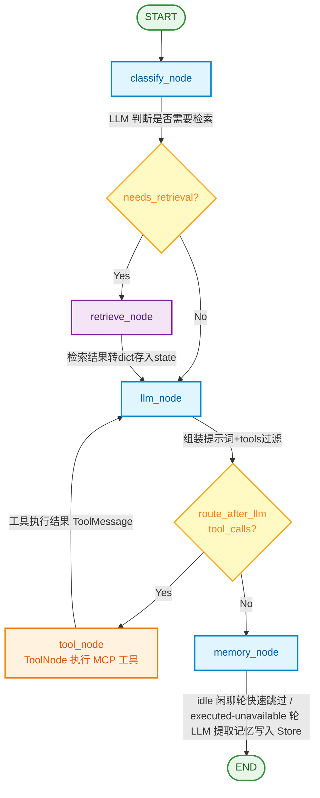
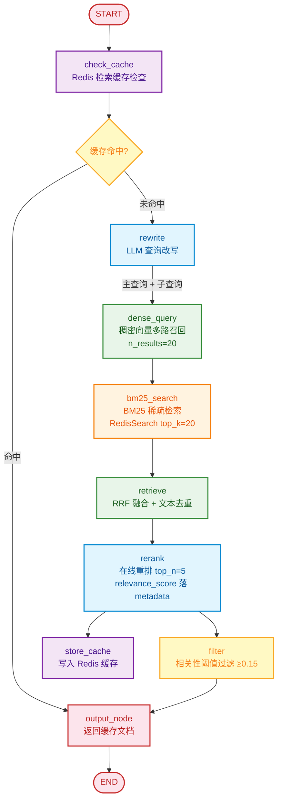
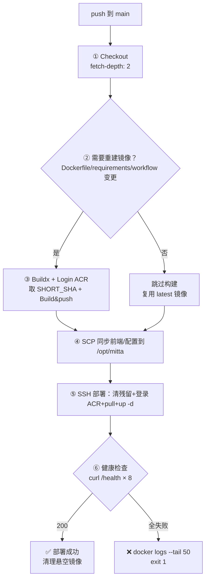

# Mitta AI 智能助理（米塔）

基于 **LangGraph + RAG + MCP + 流式 SSE** 的智能助理系统。系统内置完整的知识库检索链路（查询改写 → 多路召回 → RRF 融合 → 在线重排），支持短期记忆（多轮对话恢复）与长期记忆（用户档案），通过 MCP 协议接入外部工具（文件系统、Git、数据库等），并通过 SSE 流式输出实现打字机效果。

## 功能特性

- **意图路由**：LLM 分类器判断问题是否需要检索知识库，`Send` 条件路由按需走检索链路，避免无谓延迟
- **RAG 增强检索**：查询改写（主查询 + 子查询）→ 稠密向量多路召回 + BM25 稀疏检索（RedisSearch）→ RRF 融合去重 → SiliconFlow 在线重排 → 相关性阈值过滤
- **MCP 工具集成**：通过 Model Context Protocol 接入 filesystem、git、fetch、sqlite、sequential-thinking、memory 等外部工具；工具常驻事件循环，支持故障降级
- **智能工具筛选**：规则层（tags 关键词命中）+ 语义层（向量检索）并集，每轮只暴露相关工具给 LLM，避免工具过多导致注意力稀释
- **双通道记忆**：
  - 短期记忆：PostgresSaver 按 `thread_id` 恢复多轮对话
  - 长期记忆：PostgresStore 按 `user_id` 保存用户档案（跨会话生效）
- **用户自定义 System Prompt**：支持用户在个人信息界面上传自定义设定文件，与默认 Prompt 合并后作用于全局
- **文件上传与解析**：支持上传多种格式文件，上传后立即解析文本内容，发送消息时与用户输入一并送入 LLM
- **流式输出**：`stream_mode="messages"` 逐 token 输出，前端打字机效果；工具调用时实时显示加载状态
- **用户级 MCP 热重载**：MCP 配置存 PostgreSQL 按用户隔离，网页端保存后通过 hash 检测自动重建对话图，`POST /api/mcp/reload` 主动清除缓存立即生效，无需重启后端
- **深度思考**：DeepSeek reasoning_content 流式输出，前端可切换思考开关与推理强度（low/medium/high），思考过程可折叠展开
- **现代化前端**：Vue 3 SPA（CDN 单文件，多主题 + 响应式移动端 + 高对比几何切角动效），工具调用记录穿插展示、复制/分享/重新生成
- **安全认证**：JWT（access 15 分钟 + 隐式 refresh 30 天自动续签）+ bcrypt + 登出即时失效（Redis 删除 token）+ 请求限流
- **节点级缓存**：LangGraph CachePolicy + Redis，检索/工具/记忆节点结果按 TTL 缓存，降低 API 消耗

## 技术栈

| 层次        | 技术                                                                                               |
| --------- | ------------------------------------------------------------------------------------------------ |
| 语言/环境     | Python 3.13                                                                                      |
| Agent 编排  | LangGraph 1.x（StateGraph / Send 条件路由 / CachePolicy / Checkpointer / Store）                       |
| LLM 框架    | LangChain 1.x / langchain-openai / langchain-mcp-adapters                                        |
| 大模型       | DeepSeek（deepseek-v4-flash），OpenAI 兼容协议，支持 reasoning_content 深度思考                           |
| Embedding | SiliconFlow `BAAI/bge-m3`（1024 维）                                                                |
| 重排        | SiliconFlow `BAAI/bge-reranker-v2-m3` 在线重排                                                       |
| 向量库       | ChromaDB（默认，免部署）/ Milvus（可插拔，Protocol 抽象，零业务改动切换）                                          |
| 关系数据库     | PostgreSQL 16（LangGraph Checkpointer/Store）+ MySQL 8.0（用户表 userInfo / user_profile / user_files） |
| 缓存        | Redis 7（节点级缓存 + 检索缓存 LSH + JWT 登录态 + 限流计数 + RedisSearch BM25 全文索引）                               |
| MCP       | MCP Python SDK + FastMCP（内置 agent_server + 外部 stdio/sse 服务器连接）                                   |
| Web 框架    | FastAPI + Uvicorn（SSE 流式响应）                                                                      |
| 前端        | Vue 3（CDN SPA，html/css/js 拆分）+ 手写设计系统 + 多主题 + 响应式移动端                          |
| 反向代理      | Nginx（静态托管 + API 代理 + SSE 缓冲关闭）                                                                  |
| 认证        | JWT（PyJWT）+ bcrypt 密码哈希                                                                          |
| 可观测性      | LangSmith 链路追踪（可选）+ Loguru 结构化日志                                                                 |

## 系统架构

### Mitta AI 流程图

## 1. 主对话图（main_graph）



### 节点说明

| 节点                | 职责                | 关键实现                                                                                                                |
| ----------------- | ----------------- | ------------------------------------------------------------------------------------------------------------------- |
| **classify_node** | LLM 判断问题是否需要知识库检索 | `model.invoke([CLASSIFIER_PROMPT, user_input])`，返回 yes/no                                                           |
| **retrieve_node** | 调用 RAG 子图检索知识库    | `retrieve_graph.invoke()`，Document 转 dict 存入 state（checkpoint 反序列化兼容）                                               |
| **llm_node**      | 核心生成节点            | 组装 System Prompt（默认+用户自定义+长期记忆）→ ToolFilter 筛选工具 → `model.bind_tools()` → `model.stream()` → 合并 chunk 提取 tool_calls |
| **tool_node**     | 执行 MCP 工具         | LangGraph `ToolNode`，按工具名路由；CachePolicy 缓存同参数结果                                                                     |
| **memory_node**   | 提取长期记忆            | LLM 从对话中提取用户档案写入 PostgresStore；idle 闲聊轮快速跳过避免阻塞 SSE                                                                 |

### 条件路由

- **classify_node → route**：`needs_retrieval=True` 走检索链路，否则直接到 llm_node
- **llm_node → route_after_llm**：`tool_calls` 非空走 tool_node，否则走 memory_node
- **tool_node → llm_node**：工具执行结果回到 LLM 生成最终回答（可多轮循环）

---

## 2. RAG 检索子图（retrieve_graph）



### 节点说明

| 节点              | 职责           | 关键实现                                                                                                       |
| --------------- | ------------ | ---------------------------------------------------------------------------------------------------------- |
| **check_cache** | Redis 检索缓存检查 | `cache_service.query_cache(thread_id, question)`，LSH 快速过滤 + 向量重排验证                                         |
| **rewrite**     | LLM 查询改写     | 输出 JSON：`{主查询, 子查询[], 关键词[]}`，解决多轮指代问题                                                                     |
| **dense_query** | 稠密向量多路召回     | 原始 query + 改写 query 独立检索向量库，`n_results=20`，不做距离过滤（bge-m3 相关文档距离偏高，过滤会误杀）                               |
| **bm25_search** | BM25 稀疏检索    | RedisSearch `FT.SEARCH` 对 `kb:doc:*` HASH 做全文检索，top_k=20，补稠密向量对精确术语（"可变默认参数""bcrypt"）召回不足的短板               |
| **retrieve**    | RRF 融合 + 去重  | Reciprocal Rank Fusion（k=60）融合稠密多路 + BM25，按 doc_id 去重，按文本去重                                                |
| **rerank**      | 在线重排         | SiliconFlow `BAAI/bge-reranker-v2-m3`，按 relevance_score 降序取 top_n=5，分数写入 `doc.metadata["relevance_score"]` |
| **filter**      | 相关性阈值过滤      | 过滤 `relevance_score < 0.15` 的噪声文档；过滤后为空时兜底返回 top 3                                                         |
| **store_cache** | 写入 Redis     | 缓存键 `retrieve_cache:{thread_id}:{bucket_id}`，动态 TTL，命中自动续期                                                 |

### 关键参数

| 参数             | 值                       | 位置                                     |
| -------------- | ----------------------- | -------------------------------------- |
| 稠密召回 n_results | 20                      | `graphs/retrieve_graph.py` dense_query |
| BM25 召回 top_k  | 20                      | `graphs/retrieve_graph.py` bm25_search |
| RRF_K          | 60                      | `constant/retrieval_constants.py`      |
| 重排 top_n       | 5                       | `graphs/retrieve_graph.py` rerank      |
| 过滤阈值           | 0.15（relevance_score）   | `graphs/retrieve_graph.py` filter_node |
| 缓存 TTL         | 动态（默认 900s，命中续期）        | `constant/cache_constant.py`           |
| Embedding 模型   | BAAI/bge-m3（1024 维）     | `constant/embedding_constants.py`      |
| 重排模型           | BAAI/bge-reranker-v2-m3 | `init.py`                              |
| BM25 索引名       | kb_bm25                 | `constant/cache_constant.py`           |

### 混合检索设计思路

bge-m3 双编码器对中文技术查询区分度低（相关文档余弦相似度仅 0.4-0.6，排名 100+），而 BM25 对精确术语命中极高。两路互补：

- **稠密向量**：擅长语义相似（"如何避免默认参数陷阱" ≈ "可变默认参数的危害"）
- **BM25**：擅长精确关键词匹配（"可变默认参数""bcrypt""WebSocket" 直接命中）
- **RRF 融合**：只看排名不看绝对分数，统一两路量纲差异
- **rerank 精排**：交叉编码器对 query-doc 对做注意力计算，最终排序依据
- **阈值过滤**：用 rerank 分数（0~1）做统一过滤，0.15 以下视为噪声丢弃

### 工具筛选机制

每轮对话时，`ToolFilter.select_tools(query, tools)` 执行两层筛选：

1. **规则层**：检查工具 `tags`（如 filesystem 工具含 `["文件","目录","读写"]`），query 中包含关键词即命中
2. **语义层**：将工具描述向量化存入向量库 `MCP_TOOLS` 集合，用 query 做语义检索，top_k=12
3. 两层结果按工具名去重并集，只把候选工具 `bind_tools` 给 LLM；无命中时注入"无工具可用"提示

### 记忆体系

| 类型      | 存储                      | 隔离维度              | 生命周期                        |
| ------- | ----------------------- | ----------------- | --------------------------- |
| 短期记忆    | PostgreSQL Checkpointer | thread_id         | 会话级，可恢复                     |
| 长期记忆    | PostgreSQL Store        | user_id           | 跨会话持久                       |
| 节点缓存    | Redis                   | 输入哈希              | TTL 10~900 秒                |
| 检索缓存    | Redis + LSH             | thread_id + query | TTL 900 秒                   |
| BM25 索引 | RedisSearch HASH        | doc_id            | 持久化，知识库重建时重建                |
| 登录态     | Redis                   | user_id           | access 15 分钟 / refresh 30 天 |

## 目录结构

```
AgentProject/
├── src/                                  # 后端源码
│   ├── main.py                           # FastAPI 入口：lifespan 资源管理 + 路由注册 + 全局异常
│   ├── init.py                           # 模型/Embedding/重排/System Prompt 初始化
│   ├── config.py                         # 环境变量加载/校验 + MCP/向量库配置文件管理
│   ├── constant/                         # 常量定义（按模块分类）
│   │   ├── cache_constant.py             # Redis 缓存/向量索引/Token key/节点 TTL
│   │   ├── embedding_constants.py        # 集合名/切分参数/模型名
│   │   ├── prompt_constants.py           # 记忆提取/意图分类提示词
│   │   ├── retrieval_constants.py        # TOP_K/距离阈值/RRF 参数/改写提示词
│   │   └── tool_constant.py              # 工具集合名/筛选 top_k/距离阈值
│   ├── context/
│   │   └── user_context.py               # CtxUser 请求级用户上下文
│   ├── graphs/                           # LangGraph 图定义
│   │   ├── main_graph.py                 # 主对话图：classify→retrieve/llm→tool→memory
│   │   ├── retrieve_graph.py             # RAG 子图：cache→rewrite→retrieve→rerank
│   │   └── tool_filter.py                # 工具筛选：规则层 + 语义层
│   ├── mcp_client/                       # MCP 客户端
│   │   ├── client.py                     # MCP 连接管理/工具同步包装/故障降级/tags 注入
│   │   ├── mcp_tool_holder.py            # MCP 工具封装
│   │   ├── demo.py                       # MCP 调试示例
│   │   └── mcp_server/
│   │       └── agent_server.py           # 内置 FastMCP 服务器（chat/get_user/summarize）
│   ├── middleware/
│   │   └── rate_limit_middleware.py      # 基于 Redis 的请求限流中间件
│   ├── ragas_test/                       # RAGAS 评估与性能测试脚本
│   │   ├── ragas_eval.py                 # RAGAS 五项指标评估（context_precision/recall/faithfulness/answer_relevancy/correctness）
│   │   ├── eval_retrieval.py             # 检索召回率/延迟评估（单路 vs 三级流水线对比）
│   │   ├── eval_cache.py                 # 缓存命中率/Embedding 调用降低/污染率评估
│   │   ├── eval_cache_ttl.py             # 固定 TTL vs 动态 TTL 命中率对比
│   │   ├── eval_memory.py                # PostgresStore 读写延迟/重复写入减少/对话画像评估
│   │   ├── eval_rate_limit.py            # 限流拦截准确率/降级耗时/并发压测
│   │   ├── eval_jwt.py                   # JWT 登录态校验耗时/token 自动续签成功率
│   │   ├── eval_sse.py                   # SSE 首 token 延迟/流纯净度评估
│   │   ├── evaluate_tool_filter.py       # 工具筛选规则层+语义层准确率评估
│   │   └── *_report.json/csv             # 各评估脚本输出的报告
│   ├── routers/                          # FastAPI 路由（按模块拆分）
│   │   ├── deps.py                       # 公共依赖（require_self_or_admin）
│   │   ├── auth_router.py                # 登录/注册/密码找回/登出（Redis 即时失效）
│   │   ├── chat_router.py                # 对话(SSE)/历史/删除/停止/文件上传
│   │   ├── user_router.py                # 个人资料/密码/Prompt/主题/记忆/文件
│   │   ├── mcp_router.py                 # 用户级 MCP 配置读写 + 热重载（/api/mcp/reload）
│   │   └── system_router.py              # 健康检查/认证页面/SPA 兜底（必须最后注册）
│   ├── schemas/                          # Pydantic 请求/响应模型
│   │   ├── request_schemas/
│   │   │   ├── chat_schema.py            # ChatRequest（含 file_ids）
│   │   │   ├── login_schema.py
│   │   │   └── user_schema.py
│   │   └── response_schemas/
│   │       └── login_schema.py
│   ├── service/                          # 业务服务层
│   │   ├── chat_service.py               # 对话编排：用户级图缓存(hash热重载)/流式输出/文件解析缓存
│   │   ├── login_service.py              # 用户登录/注册（MySQL 连接池）
│   │   ├── user_profile_service.py       # 用户扩展信息（头像/风格/Prompt/主题）
│   │   ├── mcp_config_service.py         # 用户级 MCP 配置（PostgreSQL 存储，按用户隔离，安全校验+路径转换）
│   │   ├── file_upload_service.py        # 文件上传（base64 存 MySQL）/文本解析
│   │   └── cache_service.py              # Redis 缓存/LSH 向量检索/重排验证
│   ├── utils/                            # 工具函数
│   │   ├── jwt_utils.py                  # JWT 签发/验证/自动续签/登出失效/密码哈希
│   │   ├── response_util.py              # 统一响应格式
│   │   ├── doc_util.py                   # Document ↔ dict 转换
│   │   ├── lsh_util.py                   # 局部敏感哈希（缓存快速过滤）
│   │   ├── rand_id_util.py               # 随机 ID 生成
│   │   ├── tools_util.py                 # 工具安全过滤/向量化/格式化
│   │   └── deepseek_patch.py             # DeepSeek reasoning_content monkey-patch（补回 langchain_openai 丢失的思考内容）
│   └── vector/                           # 向量库抽象层
│       ├── vector_store.py               # VectorStore Protocol + Chroma/Milvus 实现
│       ├── embedding.py                  # EmbeddingProcessor：文档加载→切分→入库
│       └── retrieve_doc.py               # RetrievedDoc 数据结构
├── resources/
│   ├── config/
│   │   ├── vector_db.json                # 向量库配置（type/persist_path/collection）
│   │   ├── mcp_servers.json              # 全局默认 MCP 服务器配置（JSON 数组）
│   ├── frontend/
│   │   ├── index.html                    # Vue 3 SPA 入口
│   │   ├── assets/css/style.css          # 设计系统（CSS 变量+切角+动效+响应式）
│   │   ├── assets/js/app.js              # Vue 组件+业务逻辑（模板字符串内嵌，setup/methods）
│   │   ├── deploy/nginx/default.conf     # Nginx 配置（静态托管+API代理+SSE缓冲关闭+gzip）
│   │   └── favicon.png
│   ├── system_prompt/
│   │   └── default_system_prompt.txt     # 默认 System Prompt（Mitta 角色设定）
│   ├── knowledge-base/                   # 编程知识库（Markdown）
│   │   ├── ingest_knowledge.py           # 知识库入库脚本（向量库 + RedisSearch BM25 双写）
│   │   ├── 01~10-*.md                    # 分类知识文档
│   │   └── test-qa/                      # 测试 QA 集（eval_dataset.json）
│   ├── FAQ/                              # 在线学习平台 FAQ 知识库
│   └── chroma_db/                        # ChromaDB 持久化目录（Milvus 模式下不用）
├── tests/                                # 单元测试
├── docs/                                 # 项目文档（API.md / devlog / ci-flow.html）
├── .env.example                          # 环境变量模板
├── requirements.txt                      # Python 依赖
├── Dockerfile                            # 后端容器镜像
├── docker-compose.yml                    # 一键部署（PostgreSQL+MySQL+Redis+API+Nginx，ChromaDB 免 Milvus）
└── README.md
```

## 快速开始

### 环境要求

- Python 3.13+
- PostgreSQL 16+
- MySQL 8.0+
- Redis 7+
- 向量库：默认 ChromaDB（免部署，api 服务不硬依赖 Milvus）；如需 Milvus 2.x 另行部署
- Node.js（MCP stdio 服务器需要 npx/uvx）

### 1. 克隆项目并安装依赖

```bash
git clone https://github.com/Q1anyii/Mitta.git Mitta
cd Mitta
pip install -r requirements.txt
```

### 2. 配置环境变量

```bash
cp .env.example .env
```

编辑 `.env`，填写以下必填项：

| 变量                    | 说明                                 |
| --------------------- | ---------------------------------- |
| `DEEPSEEK_API_KEY`    | DeepSeek API 密钥（主模型 + RAGAS 评判）    |
| `SILICONFLOW_API_KEY` | 硅基流动 API 密钥（Embedding + 重排）        |
| `POSTGRESQL_DB_URL`   | PostgreSQL 连接串（Checkpointer/Store） |
| `MYSQL_DB_URL`        | MySQL 连接串（用户表）                     |
| `REDIS_DB_URL`        | Redis 连接串                          |
| `JWT_SECRET_KEY`      | JWT 签名密钥（随机强密钥）                    |

### 3. 启动基础设施

```bash
# api 核心依赖：PostgreSQL + MySQL + Redis
docker-compose up -d postgres mysql redis
# 如需 Milvus 向量库（可选）：
docker-compose up -d etcd minio milvus
```

或手动启动各服务。MySQL 需创建数据库 `mitta`，PostgreSQL 需创建数据库 `mitta`（表由服务启动时自动创建）。**低配服务器（<2GB 内存）推荐使用 ChromaDB 免 Milvus 部署**，见下方向量库配置。

### 4. 配置向量库

编辑 `resources/config/vector_db.json`：

```json
{
  "type": "chroma",
  "persist_path": "resources/chroma_db",
  "collection": "FAQ_KNOWLEDGE_BASE"
}
```

> 注意：`persist_path` 使用相对路径，容器内（WORKDIR `/app`）与本地项目根目录均可正确解析到各自的 `chroma_db` 目录。

如使用 Milvus（需自行部署），改为：

```json
{
  "type": "milvus",
  "uri": "http://localhost:19530",
  "collection": "FAQ_KNOWLEDGE_BASE"
}
```

### 5. 配置 MCP 服务器（网页端，推荐）

登录后在「设置 → MCP 配置」中直接编辑 JSON 并保存，配置存入 PostgreSQL 按用户隔离，**保存后自动热重载生效，无需重启后端**。后端通过配置 hash 检测自动重建对话图，`POST /api/mcp/reload` 可主动清除缓存立即生效。

全局默认 MCP 服务器仍可通过 `resources/config/mcp_servers.json` 配置（启动时加载，所有用户共享）。示例：

```json
[
  {
    "name": "filesystem",
    "type": "stdio",
    "command": "npx",
    "args": ["-y", "@modelcontextprotocol/server-filesystem", "/app/user_files"]
  }
]
```

不配置 MCP 不影响核心对话功能。安全校验：命令白名单（npx/uvx/node/python/python3/pipx）、Windows 路径自动转换为 Linux 容器路径、filesystem 限制在 `/app/user_files/{user_id}/` 下。

#### 系统默认 MCP 服务器

项目内置 11 台开箱即用的 MCP 服务器（`resources/config/mcp_servers.json`，启动时加载、所有用户共享），覆盖内容获取、数据存储、记忆推理与基础工具四类能力：

| 服务器 | 启动方式 | 作用 |
|---|---|---|
| filesystem | `npx @modelcontextprotocol/server-filesystem` | 文件系统读写：列目录、读/写/搜索文件、创建文件夹，访问范围限定项目目录 |
| fetch | `uvx mcp-server-fetch` | 网页抓取：按 URL 拉取网页内容并转 Markdown，供 RAG 引用实时网页信息 |
| sqlite | `uvx mcp-server-sqlite` | SQLite 操作：执行 SQL 查询/写入，数据存于项目内 `local_data.db` |
| markitdown | `uvx markitdown-mcp` | 文档转 Markdown：PDF / Word / Excel / 图片等转纯文本，供知识库切分 |
| context7 | `npx @upstash/context7-mcp` | 最新技术文档检索：拉取 API / SDK 官方文档（含版本、参数） |
| dbhub | `npx @bytebase/dbhub --demo` | 数据库交互（当前 demo 模式）：连接 MySQL/Postgres 执行 SQL、查表结构 |
| chroma | `uvx chroma-mcp` | Chroma 向量数据库：持久化知识库（`chroma_data`），语义相似度检索，RAG 核心存储 |
| memory | `npx @modelcontextprotocol/server-memory` | 知识图谱记忆：以实体/关系形式长期存储用户信息，跨会话记住用户偏好 |
| basic-memory | `uvx basic-memory mcp` | 个人知识库：管理 Markdown 笔记与实体关系，为 Agent 提供可检索长期记忆 |
| sequential-thinking | `npx @modelcontextprotocol/server-sequential-thinking` | 分步推理：强制模型逐步思考（拆解问题、验证假设），适合排错与复杂分析 |
| time | `uvx mcp-server-time` | 时间服务：获取当前时间、时区换算、日期计算 |

能力分工：**filesystem / markitdown / fetch / context7** 负责获取内容，**chroma / sqlite / dbhub** 负责存储与查询，**memory / basic-memory / sequential-thinking** 负责记忆与推理，**time** 提供基础工具。删除某项只需从 `mcp_servers.json` 移除对应条目，无需改动代码。

### 6. 知识库入库（可选）

```bash
cd src
python ../resources/knowledge-base/ingest_knowledge.py
```

入库脚本同时写入向量库（向量索引）和 RedisSearch（BM25 全文索引），两者用相同 doc_id 对齐，RRF 融合时靠 id 匹配。

### 7. 启动后端

```bash
cd src
uvicorn main:app --host 0.0.0.0 --port 8000 --reload
```

### 8. 启动前端（Nginx）

将 `resources/frontend/nginx.conf` 复制到 Nginx 配置目录，修改 `root` 路径指向 `resources/frontend/`，然后：

```bash
nginx
# 或 nginx -s reload
```

访问 `http://localhost` 即可使用。开发阶段也可直接访问 `http://localhost:8000`（后端托管 SPA）。

## API 接口一览

> 完整的请求/响应示例、错误码说明、SSE 事件格式见 [docs/API.md](docs/API.md)。

### 认证

| 方法   | 路径              | 说明   |
| ---- | --------------- | ---- |
| POST | `/api/login`    | 用户登录（返回 access token，refresh 隐式存 Redis） |
| POST | `/api/register` | 用户注册 |
| POST | `/api/recover`  | 密码找回 |
| POST | `/api/logout`   | 登出（Redis 删除 access+refresh，即时失效） |

### 对话

| 方法     | 路径                              | 说明                         |
| ------ | ------------------------------- | -------------------------- |
| POST   | `/api/chat/`                    | 发送消息（SSE 流式响应，支持 file_ids） |
| GET    | `/api/chat/{thread_id}/history` | 获取会话历史                     |
| DELETE | `/api/chat/{thread_id}`         | 删除会话                       |
| POST   | `/api/chat/stop`                | 停止回复                       |
| POST   | `/api/chat/upload`              | 上传文件（保存后立即解析文本）            |
| DELETE | `/api/files/{file_id}`          | 删除已上传文件                    |

### 用户

| 方法      | 路径                                   | 说明                     |
| ------- | ------------------------------------ | ---------------------- |
| GET     | `/api/users/{user_id}/profile`       | 获取个人信息                 |
| PUT     | `/api/users/{user_id}/profile`       | 更新个人信息（用户名/头像/风格）      |
| PUT     | `/api/users/{user_id}/password`      | 修改密码                   |
| GET/PUT | `/api/users/{user_id}/system-prompt` | 获取/更新自定义 System Prompt |
| GET/PUT | `/api/users/{user_id}/theme`         | 获取/更新前端主题              |
| GET     | `/api/users/{user_id}/memory`        | 获取长期记忆                 |
| GET     | `/api/users/{user_id}/sessions`      | 获取会话列表                 |
| GET     | `/api/users/{user_id}/files`         | 获取已上传文件列表              |
| GET/PUT | `/api/users/{user_id}/mcp`           | 获取/更新用户级 MCP 配置        |

### MCP / 系统

| 方法      | 路径                | 说明                    |
| ------- | ----------------- | --------------------- |
| GET/PUT | `/api/mcp/config` | 当前用户 MCP 配置读写（PostgreSQL 按用户隔离） |
| POST    | `/api/mcp/reload` | 重载当前用户 MCP 配置（清除图缓存+关闭旧连接，立即生效） |
| DELETE  | `/api/mcp/config/{server_name}` | 删除单个 MCP 服务器配置 |
| GET     | `/health`         | 健康检查                  |
| GET     | `/mcp`            | 内置 MCP 服务器端点（FastMCP） |

## 核心设计说明

### MCP 工具常驻事件循环

MCP 工具通过 `langchain_mcp_adapters` 加载为 async 工具，闭包捕获绑定创建时事件循环的 `ClientSession`。同步图（ToolNode）在线程池执行时会临时新建事件循环，跨循环调用 session 会失败/挂起（Windows 下 mcp 库 cancel scope 泄漏还会注入 CancelledError 中断整图）。解决方案：

- 启动时创建专用守护线程运行独立事件循环（`mcp-tool-loop`），MCP 连接建立与工具调用全部提交到该循环（`asyncio.run_coroutine_threadsafe`）
- `make_sync_tool` 将 async 工具包装为同步 StructuredTool，含 30 秒调用超时，超时由 ToolNode 转错误消息，不中断对话链路
- 单个 MCP 服务器连接失败不影响其他服务器（15 秒连接超时 + 故障降级跳过）
- MCP 工具按服务器名注入 tags（`SERVER_TAGS` 映射），供工具筛选规则层命中
- 关闭时按序在工具循环内释放 MCP 子进程连接，避免资源泄漏

### 智能工具筛选

每轮对话时，`ToolFilter.select_tools(query, tools)` 执行两层筛选并集，只把候选工具暴露给 LLM：

1. **规则层**：检查工具 `tags`（如 filesystem 工具含 `["文件","目录","读写","file"]`），query 中包含关键词即命中，零延迟
2. **语义层**：工具描述向量化存入向量库 `MCP_TOOLS` 集合，用 query 做语义检索（top_k=12，距离阈值 0.6），失败自动熔断降级为纯规则层
3. 两层结果按工具名去重并集；无命中时不 bind 空列表（OpenAI 兼容 API 会 400），改用裸模型并注入"无工具可用"提示
4. 多轮指代增强：输入含"继续/刚才/那个"等指代词时，拼接最近一轮 AI 回复前 200 字符辅助筛选

### 节点级缓存（LangGraph CachePolicy + Redis）

> 注：retrieve_node 和 tool_node 缓存已删除，原因：
> 1. 子图 retrieve_graph 内置缓存机制，外层设置缓存目的减少一次子图创建，后续可把子图缓存机制抽出
> 2. tool_node 的缓存 key 不带 tool_call_id，若缓存复用影响 ToolMessage 导致工具调用失败

LangGraph `CachePolicy` 配合 `RedisCache`，在图编译时注入，节点结果按 TTL 缓存到 Redis：

| 节点            | 缓存键                                    | TTL | 策略                |
| ------------- | -------------------------------------- | --- | ----------------- |
| memory_node   | 消息轮次+输入+AI回复（仅 executed/unavailable 轮） | 10s | idle 闲聊轮返回随机键永不命中 |

缓存键自定义设计：默认 key_func 对节点输入整体 pickle 哈希，而 Send payload 含每轮变化的 messages，会导致缓存键每轮都变、永不命中。自定义 key_func 只取稳定部分（用户输入/工具参数），确保缓存可命中。

### 检索结果缓存（CacheService + Redis Search + LSH）

除 LangGraph 节点级缓存外，`CacheService` 基于 Redis Search 构建了独立的检索结果缓存层，在 `retrieve_graph` 的 `check_cache` 节点使用：

- **缓存键**：`retrieve_cache:{thread_id}:{bucket_id}`，其中 bucket_id 通过 LSH（局部敏感哈希）对 query 向量做嵌套分桶，解决 Redis 无法直接做向量相似度检索的问题
- **两级验证**：LSH 快速过滤候选 → 用 bge-reranker-v2-m3 验证候选问题与当前问题是否语义等价（阈值 0.5，实测同义改写 0.89+，无关问题 0.0）
- **动态 TTL**：默认 900 秒，每命中一次自动刷新过期时间，兼顾热点问题长缓存与冷门问题快速淘汰
- **降级策略**：Redis 不可用时静默降级为不缓存，不阻塞检索主链路

### 流式输出与工具调用状态

- 使用 `stream_mode="messages"` 捕获图中所有 LLM token 事件，按 `meta["langgraph_node"]` 过滤只输出 llm_node 的增量
- SSE 事件类型：`content`（文本 token）、`tool_call_start`（工具名+参数）、`tool_call_end`（工具名+结果摘要）、`error`（异常）、`[DONE]`（结束）
- 前端监听 `tool_call_start/end` 事件，在 AI 消息下方显示"正在调用工具：xxx"加载条
- 流式模式下 tool_calls 分块传输，通过 `AIMessageChunk.__add__` 合并所有 chunk 提取完整工具调用，避免取最后一个 chunk 导致 tool_calls 为空

### 文件上传与解析

1. 前端上传文件 → `POST /api/chat/upload` → 保存到 MySQL `user_files` 表（base64 编码，单文件上限 10MB）
2. 保存后立即调用 `chat_service.parse_and_cache_file()` 解析文本（阻塞执行，接口返回即解析完成）
3. 解析结果缓存到内存 `_file_content_cache`（key=`{user_id}:{file_id}`），避免重复解析
4. 发送消息时前端传 `file_ids` → 后端从缓存读取文件内容 → 以"【文件名】+内容"格式拼接到 `input_str` → 传入 LLM
5. 支持 txt/md/csv/json/py/js 等纯文本格式（UTF-8/GBK 编码兼容）；PDF 使用 PyPDFLoader 解析；不支持的格式返回 `parsed=false`
6. 删除文件时同步清除解析缓存

### 安全设计

- JWT access token 15 分钟过期，Redis 存 refresh token 30 天，后端在 token 过期时自动续签（对前端透明）
- 密码使用 bcrypt 哈希（截断 72 字节，bcrypt 上限）
- `/api/chat/` 接口限流：每 IP 60 秒 30 次（Redis 计数器，Redis 不可用时降级内存限流）
- MCP 配置文件路径白名单校验（仅允许项目 resources/、config/ 和用户主目录），防止写入系统敏感目录
- 会话归属校验：非本人 thread_id 返回 403，防止会话劫持
- 全局异常处理器：记录完整堆栈到日志，返回给客户端的信息不含堆栈细节
- MCP 文件系统工具通过 allowed directories 限制访问范围

### 用户级 MCP 热重载

MCP 配置从「全局文件 + 重启生效」升级为「PostgreSQL 按用户存储 + 运行时热重载」：

- **存储隔离**：`user_mcp_servers` 表按 `user_id` 存储，每个用户独立配置，互不影响
- **自动重建**：`ChatService._user_graph_cache` 以 `(config_hash, graph, mcp_connections)` 缓存用户图，每次对话调用 `_get_user_graph(user_id)` 时计算配置 MD5，hash 变化则关闭旧 MCP 连接、建立新连接、重建 LangGraph
- **主动重载**：`POST /api/mcp/reload` 主动 pop 缓存条目并关闭旧子进程连接，让配置立即生效（不等下一条消息的 hash 检测）
- **安全校验**：保存时校验命令白名单、包名白名单、Windows→Linux 路径自动转换、filesystem 目录隔离、禁止敏感环境变量、sse 禁止内网地址
- **降级策略**：用户 MCP 连接失败时静默降级为全局工具，不阻塞对话

### 深度思考（reasoning_content）

DeepSeek 模型返回的 `reasoning_content`（思考过程）在 langchain_openai 的标准解析中会被丢弃。通过 `utils/deepseek_patch.py` monkey-patch `langchain_openai.chat_models.base` 的消息解析逻辑，将 `reasoning_content` 补回 `AIMessage.additional_kwargs`，经 SSE 流式推送到前端：

- 前端可切换「深度思考」开关与推理强度（low/medium/high），状态持久化到 localStorage
- 思考过程以折叠面板展示在 AI 回复上方，点击展开/收起，流式更新时自动滚动到底部
- 思考内容不参与最终回答，但可帮助用户理解模型推理链路

### RAGAS 质量评估

项目内置完整的 RAGAS 评估体系（`src/ragas_test/`），覆盖检索质量、生成质量、系统性能三大维度：

**检索质量（ragas_eval.py）**：五项 RAGAS 指标自动化评估

- `context_precision`：检索上下文的精确率（相关文档占比）
- `context_recall`：检索上下文的召回率（ground_truth 被覆盖比例）
- `faithfulness`：回答与上下文的一致性（幻觉率反向指标）
- `answer_relevancy`：回答与问题的相关性
- `answer_correctness`：回答与 ground_truth 的正确率

测试集 `resources/knowledge-base/test-qa/eval_dataset.json` 含 50 条刁钻 QA，覆盖 Python/FastAPI/LangGraph/RAG/数据库/架构/安全等模块。

**性能基准（eval_*.py）**：

| 脚本                        | 评估指标                              |
| ------------------------- | --------------------------------- |
| `eval_retrieval.py`       | Top5 召回率、检索 P95 延迟、单路 vs 混合检索对比   |
| `eval_cache.py`           | 缓存命中率、Embedding 调用降低比例、污染率        |
| `eval_cache_ttl.py`       | 固定 TTL vs 动态 TTL 命中率提升百分点         |
| `eval_memory.py`          | PostgresStore 读写延迟、重复写入减少率、对话画像生成 |
| `eval_rate_limit.py`      | 限流拦截准确率、Redis 断连降级切换耗时、并发压测       |
| `eval_jwt.py`             | 登录态校验平均耗时、token 过期自动续签成功率         |
| `eval_sse.py`             | 首 token 延迟、流纯净度（无分类器/记忆提取混入）      |
| `evaluate_tool_filter.py` | 工具筛选规则层+语义层准确率                    |

所有评估脚本输出 JSON 报告到 `src/ragas_test/`，可用于 CI 回归或性能对比。

## 测试

### 单元测试

使用 pytest 框架，覆盖核心工具模块：

| 测试文件 | 覆盖模块 | 用例数 |
| -------- | -------- | ------ |
| `tests/test_config.py` | 环境变量加载/校验/布尔解析 | 18 |
| `tests/test_jwt_utils.py` | JWT 签发/验证/过期/密码哈希(bcrypt) | 14 |
| `tests/test_rand_id_util.py` | 随机 ID 生成/唯一性/MySQL int 范围 | 11 |

**运行方式**：

```bash
cd src
pytest ../tests/ -v
```

**最新结果**（2026-09-06）：53 passed / 1 failed（98.1%）。失败项为 `test_access_token_expiration` 的微秒级精度断言（JWT exp 仅精确到秒），非业务逻辑问题。

### RAGAS 质量评估

`src/ragas_test/` 目录包含完整的 RAGAS 评估体系，覆盖检索质量、生成质量、系统性能三大维度，详见上文「RAGAS 质量评估」节。运行方式：

```bash
cd src
python ragas_test/ragas_eval.py          # RAGAS 五项指标
python ragas_test/eval_retrieval.py      # 检索召回率/延迟
python ragas_test/eval_cache.py          # 缓存命中率
```

## Docker 部署

### 一键启动全部服务

```bash
docker-compose up -d
```

服务端口：

| 服务         | 端口        | 说明                 |
| ---------- | --------- | ------------------ |
| Nginx      | 80/443    | 前端 + API 统一入口（HTTPS） |
| FastAPI    | 8000      | 后端 API（直接访问）       |
| PostgreSQL | 5432      | Checkpointer/Store/MCP配置 |
| MySQL      | 3306      | 用户数据               |
| Redis      | 6379/8001 | 缓存 + RedisSearch BM25  |
| Milvus     | 19530     | 向量库（可选，api 不硬依赖）  |
| etcd       | 2379      | Milvus 依赖（可选）       |
| MinIO      | 9000/9001 | Milvus 依赖（可选）       |

> **低配服务器方案**：1核2GB 以下服务器建议停用 Milvus/etcd/MinIO，将 `resources/config/vector_db.json` 改为 `chroma` 类型，仅运行 api+nginx+postgres+mysql+redis 五个容器。

### 仅启动后端

```bash
docker build -t mitta-ai .
docker run -p 8000:8000 --env-file .env mitta-ai
```

## 持续集成与部署（CI/CD）

项目使用 GitHub Actions 实现「**境外构建 → 阿里云 ACR 镜像仓库 → 服务器拉取部署**」的混合方案，解决两个部署痛点：

1. **服务器无法访问 GitHub**：不走服务器 `git pull`，代码由 Actions 拉取后 SCP 同步
2. **服务器本地 build 太慢**：`apt-get` 从 deb.debian.org 下载超时，改为服务器只从 ACR 拉现成镜像

### 工作流文件

`.github/workflows/acr-cicd.yml`，触发条件：push 到 `main` 分支。

### 部署架构

```
┌─────────────┐   git push    ┌──────────────────────┐
│  本地开发机   │ ────────────► │  GitHub Actions       │
└─────────────┘               │  ① 拉代码+构建镜像       │
                              │  ② 推 ACR（sha+latest） │
                              └──────────┬───────────┘
                                         │ SCP 同步前端/配置
                                         ▼
┌─────────────┐   docker pull    ┌──────────────────────┐
│ 阿里云 ACR   │ ◄────────────── │  阿里云 ECS 服务器      │
│ 镜像仓库      │                 │  docker compose up    │
└─────────────┘                 └──────────────────────┘
```

### 完整流水线（7 步）



### 镜像构建跳过机制（提速核心）

`git diff --name-only HEAD~1 HEAD` 检查本次提交变更范围：

| 变更文件 | 是否重建镜像 | 耗时 |
| ------- | ---------- | ---- |
| 仅源码 / 前端 / 配置 | 否（复用 latest） | **~2-3 分钟** |
| `Dockerfile` / `requirements.txt` / `.github/workflows/` | 是（全量构建） | 8-12 分钟 |

构建产物同时打 `SHORT_SHA` 与 `latest` 两个 tag，跳过构建的部署直接从 ACR 拉取已有 `latest`。

### 所需 Secrets

在 GitHub 仓库 Settings → Secrets and variables → Actions 中配置：

| Secret | 说明 |
| ------ | ---- |
| `ACR_REGISTRY` | 阿里云 ACR 地址（如 `registry.cn-hangzhou.aliyuncs.com`） |
| `ACR_USERNAME` | ACR 用户名 |
| `ACR_PASSWORD` | ACR 密码 |
| `ECS_HOST` | 服务器公网 IP |
| `ECS_USER` | SSH 用户名（如 root） |
| `ECS_SSH_KEY` | SSH 私钥 |

### 部署脚本要点

- **[0] 清理配置残留**：`rm -f resources/config/.mcp_config_path .vector_config_path`，防止容器内把本地 Windows 路径残留解析成 `/app/E:\...` 导致全局配置读不到
- **SCP 同步目录**：`resources/frontend`（前端即时生效）、`docker-compose.yml`、`resources/config`、`resources/system_prompt`
- **只拉镜像不本地 build**：`docker compose pull api && docker compose up -d --no-build api`
- **健康检查**：`sleep 10` + `curl localhost:8000/health` 最多 8 次（5 秒间隔），8 次全失败则贴日志并 `exit 1`

> 完整流程图见 [docs/ci-flow.html](docs/ci-flow.html)。

## 贡献指南

欢迎提交 Issue 和 Pull Request！开发环境搭建、代码规范、提交规范、PR 流程详见 [CONTRIBUTING.md](CONTRIBUTING.md)。

## 开发说明

### 新增 MCP 工具

**用户级（推荐）**：登录后在网页「设置 → MCP 配置」中添加，保存后自动热重载生效。

**全局默认**：
1. 在 `resources/config/mcp_servers.json` 添加服务器配置
2. 如需规则层命中，在 `src/mcp_client/client.py` 的 `SERVER_TAGS` 中添加关键词
3. 重启后端，日志会显示加载的工具数量

### 切换向量库

修改 `resources/config/vector_db.json` 的 `type` 字段（`chroma` 或 `milvus`），业务代码零改动。默认使用 ChromaDB（免部署）；低配服务器勿用 Milvus。

### 添加新的 API 路由

1. 在 `src/routers/` 下新建或编辑路由文件
2. 在 `src/main.py` 中 `app.include_router()` 注册
3. 注意 `system_router` 必须最后注册（SPA 兜底路由）

### 后续规划

1. 完善向量存储多模态功能
2. 完善 mcp_server / 自定义 MCP 模块，原生支持某些工具而非外部依赖
3. 引入 skills 相关功能
4. 引入 interrupt 功能，在涉及敏感操作时由用户确认是否继续
5. 目前只在源码层面支持自定义模型，后续需在设置界面添加接口
6. 引入 token 消耗检测

## 许可证

见 [LICENSE](LICENSE) 文件。
