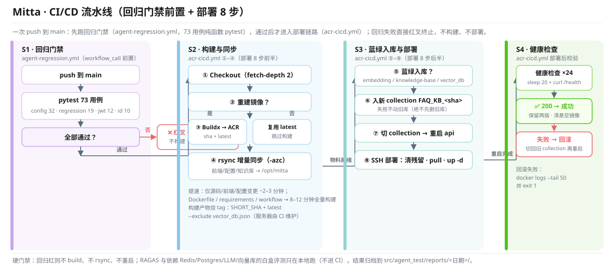

# 部署与 CI/CD 详解

> 本文档承接根 README 原「快速开始」「Docker 部署」「持续集成与部署（CI/CD）」章节的完整内容。

## 环境要求

| 依赖 | 版本/说明 |
|---|---|
| Python | 3.12（.venv 或 conda 均可） |
| PostgreSQL | 16+（本地或 Docker，创建数据库 `mitta`） |
| Redis | 7+（**必须含 RediSearch 模块**，推荐 redis-stack；BM25 检索依赖） |
| 向量库 | ChromaDB（免部署，低配首选）或 Milvus 2.x（可选） |
| Docker | 部署到服务器时需要 |

## 快速开始（完整步骤）

### 1. 克隆仓库

```bash
git clone https://github.com/Q1anyii/Mitta.git
cd Mitta
```

### 2. 配置环境变量

```bash
cp .env.example .env
```

| 变量 | 说明 |
|---|---|
| `DEEPSEEK_API_KEY` | DeepSeek API 密钥（主模型 + RAGAS 评判） |
| `SILICONFLOW_API_KEY` | 硅基流动 API 密钥（Embedding + 重排） |
| `POSTGRESQL_DB_URL` | PostgreSQL 连接串（Checkpointer/Store + 用户表） |
| `REDIS_DB_URL` | Redis 连接串 |
| `JWT_SECRET_KEY` | JWT 签名密钥（随机强密钥） |

### 3. 启动基础设施

```bash
# api 核心依赖：PostgreSQL + Redis
docker-compose up -d postgres redis
# 如需 Milvus 向量库（可选）：
docker-compose up -d etcd minio milvus
```

或手动启动各服务。PostgreSQL 需创建数据库 `mitta`（表由服务启动时自动创建，用户表 userinfo / user_profile / user_files 亦由各服务自动建表）。**低配服务器（<2GB 内存）推荐使用 ChromaDB 免 Milvus 部署**，见下方向量库配置。

### 4. 配置向量库

编辑 `resources/config/vector_db.json`：

```json
{
  "type": "chroma",
  "persist_path": "resources/chroma_db",
  "collection": "FAQ_KNOWLEDGE_BASE"
}
```

> 注意：`persist_path` 使用相对路径，容器内（WORKDIR `/app`）与本地项目根目录均可正确解析到各自的 `chroma_db` 目录。

如使用 Milvus（需自行部署），改为：

```json
{
  "type": "milvus",
  "uri": "http://localhost:19530",
  "collection": "FAQ_KNOWLEDGE_BASE"
}
```

### 5. 配置 MCP 服务器（网页端，推荐）

登录后在「设置 → MCP 配置」中直接编辑 JSON 并保存，配置存入 PostgreSQL 按用户隔离，**保存后自动热重载生效，无需重启后端**。后端通过配置 hash 检测自动重建对话图，`POST /api/mcp/reload` 可主动清除缓存立即生效。

全局默认 MCP 服务器仍可通过 `resources/config/mcp_servers.json` 配置（启动时加载，所有用户共享）。示例：

```json
[
  {
    "name": "filesystem",
    "type": "stdio",
    "command": "npx",
    "args": ["-y", "@modelcontextprotocol/server-filesystem", "/app/user_files"]
  }
]
```

不配置 MCP 不影响核心对话功能。安全校验：命令白名单（npx/uvx/node/python/python3/pipx）、Windows 路径自动转换为 Linux 容器路径、filesystem 限制在 `/app/user_files/{user_id}/` 下。

#### 系统默认 MCP 服务器

项目内置 8 台开箱即用的 MCP 服务器（`resources/config/mcp_servers.json`，启动时加载、所有用户共享），覆盖内容获取、数据存储、记忆推理与基础工具四类能力：

| 服务器 | 启动方式 | 作用 |
|---|---|---|
| filesystem | `npx @modelcontextprotocol/server-filesystem` | 文件系统读写：列目录、读/写/搜索文件、创建文件夹，访问范围限定项目目录 |
| mittatools | `python src/mcp_client/mcp_server/mitta_tools_server.py`（cwd=`/app`） | 本地实用工具集：Bing 搜索（无 key）/网页抓取/git 系列/文件搜索与安全读取/项目结构 |
| sqlite | `uvx mcp-server-sqlite` | SQLite 操作：执行 SQL 查询/写入，数据存于项目内 `local_data.db` |
| sequential-thinking | `npx @modelcontextprotocol/server-sequential-thinking` | 分步推理：强制模型逐步思考（拆解问题、验证假设），适合排错与复杂分析 |
| memory | `npx @modelcontextprotocol/server-memory` | 知识图谱记忆：以实体/关系形式长期存储用户信息，跨会话记住用户偏好 |
| time | `uvx mcp-server-time` | 时间服务：获取当前时间、时区换算、日期计算 |
| context7 | `npx @upstash/context7-mcp` | 最新技术文档检索：拉取 API / SDK 官方文档（含版本、参数） |
| dbhub | `npx @bytebase/dbhub --demo` | 数据库交互（当前 demo 模式）：连接 MySQL/Postgres 执行 SQL、查表结构 |

能力分工：**filesystem / mittatools / context7** 负责获取内容（网页抓取由 mittatools 的 `fetch_url` 承接，原 `fetch` 因仅兼容 OpenAI MCP 客户端已移除），**sqlite / dbhub** 负责存储与查询，**memory / sequential-thinking** 负责记忆与推理，**time** 提供基础工具。删除某项只需从 `mcp_servers.json` 移除对应条目，无需改动代码。Dockerfile 额外内置 `@modelcontextprotocol/server-github` 等 npm 包，供用户级 MCP 配置按需启用。

> **配置注意**：`mittatools` 的 `cwd` 必须是镜像代码根 `/app`。若指向容器内被自动建出的空目录（如 `/app/user_files/user_01/AgentProject`），`client.py` 的脚本预检会失败 → 该 server 被静默跳过、12 个工具线上全部缺失，而服务与健康检查一切正常。`npx`/`uvx` 类服务器 `args[0]` 是包名、不走脚本预检，不受影响。改完配置请实际验证工具数，不要只看服务启动成功。

### 6. 知识库入库（可选）

入库脚本同时写入向量库（向量索引）和 RedisSearch（BM25 全文索引），两者用相同 doc_id 对齐，RRF 融合时靠 id 匹配。

**方式一：脚本全量入库**（初次建库推荐）

```bash
cd src
python ../resources/knowledge-base/ingest_knowledge.py
# 蓝绿入库到指定 collection（CI 用）：--collection FAQ_KNOWLEDGE_BASE_<short_sha> --redis-url redis://redis:6379/0
```

**方式二：HTTP 接口增量入库**（日常维护推荐，无需登录服务器）

| 方法 | 路径 | 说明 |
|---|---|---|
| POST | `/api/knowledge/upload` | 上传文档入库（.md/.txt/.pdf，≤10MB，双通道自动写入） |
| GET | `/api/knowledge/documents` | 列出知识库全部文档（按来源聚合，含 chunk 数） |
| DELETE | `/api/knowledge/source/{source}` | 删除指定来源文件的全部 chunk |
| DELETE | `/api/knowledge/documents/{doc_id}` | 删除单个文档 chunk |

```bash
# 示例：增量上传一篇文档（需 JWT）
curl -X POST http://localhost:8000/api/knowledge/upload \
  -H "Authorization: Bearer <token>" \
  -F "file=@docs/new-article.md"
```

重复上传同一文档时基于内容哈希生成 doc_id 自动覆盖更新，不产生重复；BM25 索引自动覆盖新写入的 `kb:doc:*` 哈希，无需重建。

**方式三：CI 蓝绿自动入库**（见「CI/CD 蓝绿入库切换」）——push 到 main 且改动命中 `src/constant/embedding_constants.py` / `resources/knowledge-base/` / `resources/config/vector_db.json` 时，Actions 自动入库到新 collection `FAQ_KNOWLEDGE_BASE_<short_sha>` → 切换 vector_db.json → 重启 → 健康检查通过后保留最近两个 collection（`cleanup_collections.py --keep`），失败自动回滚旧 collection。**绝不先删旧库**。

### 7. 启动后端

```bash
cd src
uvicorn main:app --host 0.0.0.0 --port 8000 --reload
```

### 8. 启动前端（Nginx）

将 `resources/frontend/nginx.conf` 复制到 Nginx 配置目录，修改 `root` 路径指向 `resources/frontend/`，然后：

```bash
nginx
# 或 nginx -s reload
```

访问 `http://localhost` 即可使用。开发阶段也可直接访问 `http://localhost:8000`（后端托管 SPA）。

## Docker 部署

### 运维与可观测性

- **请求链路追踪**：每个请求生成 UUID4 `request_id`，通过 contextvar 注入 loguru 日志，并以 `X-Request-ID` 响应头回传前端；线上排障时凭一个 ID 串起全链路日志
- **日志轮转**：loguru 按 10MB 单文件轮转，保留 7 天并 gzip 压缩，避免容器日志无限增长
- **一键回滚**：`deploy/rollback.sh` 传 short_sha 即可切到指定镜像版本并重启，CI/CD 出问题时一条命令回退
- **数据库备份**：`deploy/backup_pg.sh` 每日 `pg_dump`，保留 7 天，备份前检查磁盘水位，水位不足告警跳过

### 一键启动全部服务

```bash
docker-compose up -d
```

服务端口：

| 服务 | 端口 | 说明 |
|---|---|---|
| Nginx | 80/443 | 前端 + API 统一入口（HTTPS） |
| FastAPI | 8000 | 后端 API（直接访问） |
| PostgreSQL | 5432 | Checkpointer/Store/MCP配置/用户表 |
| Redis | 6379/8001 | 缓存 + RedisSearch BM25 |
| Milvus | 19530 | 向量库（可选，api 不硬依赖） |
| etcd | 2379 | Milvus 依赖（可选） |
| MinIO | 9000/9001 | Milvus 依赖（可选） |

> **低配服务器方案**：1核2GB 以下服务器建议停用 Milvus/etcd/MinIO，将 `resources/config/vector_db.json` 改为 `chroma` 类型，仅运行 api+nginx+postgres+redis 四个容器。

### 仅启动后端

```bash
docker build -t mitta-ai .
docker run -p 8000:8000 --env-file .env mitta-ai
```

## CI/CD 持续集成与部署

项目使用 GitHub Actions 实现「**境外构建 → 阿里云 ACR 镜像仓库 → 服务器拉取部署**」的混合方案，解决两个部署痛点：

1. **服务器无法访问 GitHub**：不走服务器 `git pull`，代码由 Actions 拉取后 rsync 同步
2. **服务器本地 build 太慢**：`apt-get` 从 deb.debian.org 下载超时，改为服务器只从 ACR 拉现成镜像

### 工作流文件

- `.github/workflows/acr-cicd.yml`：触发条件为 push 到 `main` 分支（构建镜像→推 ACR→rsync→部署→健康检查）；含 **RAG 入库检测 + 蓝绿切换**
  - **构建缓存隔离（2026-09-24，`d768ed1`）**：`cache-from/to` 固定 `scope=mitta-main` + `mode=max` 完整导出，避免 gha 默认 scope（buildkit）与其他 workflow（agent-regression）互相挤掉缓存导致依赖层反复全量重建+上传；首次用新 scope 会全量"种缓存"，第二次起依赖层稳定命中
- `.github/workflows/agent-regression.yml`：**Agent 回归测试流水线（E14）**——被 `acr-cicd.yml` 通过 `workflow_call` 调用，作为部署前置 job（也支持 `workflow_dispatch` 手动触发）；在 ubuntu-latest + Python 3.12 上运行纯函数 pytest，**73 用例、零外部依赖**（不连 Redis/Postgres/LLM/向量库），失败时上传 pytest 报告 artifact：

| 测试文件 | 覆盖内容 | 用例数 |
|---|---|---|
| `tests/test_config.py` | 环境变量加载/校验/布尔解析 | 32 |
| `tests/test_agent_regression.py` | 动态路由/MCP 安全/工具兜底/记忆缓存 key/工具名解析/安全过滤 | 19 |
| `tests/test_jwt_utils.py` | JWT 签发/验证/过期/密码哈希(bcrypt) | 12 |
| `tests/test_rand_id_util.py` | 随机 ID 生成/唯一性/int 范围 | 10 |

**明确排除**：RAGAS 五指标（耗时 + LLM 评分）与依赖 Redis/Postgres/LLM/向量库的离线白盒评测（只在本地评估）。

> **与部署链路的关系**：`acr-cicd.yml` 的 `build_deploy` job 通过 `needs: regression` **前置调用** `agent-regression.yml`——回归红则不 build、不 rsync、不重启，是硬门禁。回归流水线复用同一份 pytest 命令，避免两处配置漂移；RAGAS 与依赖外部服务的白盒评测仍只在本地跑。

### 部署架构

```
┌─────────────┐   git push    ┌──────────────────────┐
│  本地开发机   │ ────────────► │  GitHub Actions       │
└─────────────┘               │  ① 拉代码+构建镜像       │
                              │  ② 推 ACR（sha+latest） │
                              └──────────┬───────────┘
                                         │ rsync 增量同步前端/配置
                                         ▼
┌─────────────┐   docker pull    ┌──────────────────────┐
│ 阿里云 ACR   │ ◄────────────── │  阿里云 ECS 服务器      │
│ 镜像仓库      │                 │  docker compose up    │
└─────────────┘                 └──────────────────────┘
```

### 完整流水线（回归门禁前置 + 部署 8 步）

一次 push 到 `main`：先跑 **回归门禁**（`agent-regression.yml`，73 用例纯函数 pytest），通过后才进入 **部署链路**（`acr-cicd.yml`，8 步）；回归失败直接红叉终止，不构建、不部署。

<div align="center">
  
</div>

**回归门禁覆盖什么**（都是纯函数、确定性断言，秒级出结果）：动态路由分流规则、MCP 安全白名单（命令/包名/env/sse/type）、工具结果兜底与按轮计数、记忆缓存 key 构造、工具名解析、配置与 JWT/ID 生成。

**为什么不把重活放进 CI**：RAGAS 五指标要用 LLM 打分（分钟级 + 抖动大），离线白盒评测要连 Redis/Postgres/向量库/在线 LLM——放进 CI 既不划算也不稳定，因此只在本地跑，结果归档到 `src/agent_test/reports/<日期>/` 做版本间对比。

### 镜像构建跳过机制（提速核心）

`git diff --name-only ${LAST_IMAGE_BUILD_SHA}..HEAD` 回溯检查「自上次成功构建镜像以来」的变更（首次取 `HEAD~50..HEAD`，遇任一敏感文件即判定需要重建）：

| 变更范围 | 是否重建镜像 | 耗时 |
|---|---|---|
| 仅 `docs/**` / `README.md` / `.agent/**` 等非敏感路径 | 否（复用 latest，rsync 增量同步） | **~2-3 分钟** |
| `src/` / `Dockerfile` / `requirements.txt` / `.github/workflows/` | 是（全量构建） | 8-12 分钟 |

构建产物同时打 `SHORT_SHA` 与 `latest` 两个 tag，跳过构建的部署直接从 ACR 拉取已有 `latest`。

### 所需 Secrets

在 GitHub 仓库 Settings → Secrets and variables → Actions 中配置：

| Secret | 说明 |
|---|---|
| `ACR_REGISTRY` | 阿里云 ACR 地址（如 `registry.cn-hangzhou.aliyuncs.com`） |
| `ACR_USERNAME` | ACR 用户名 |
| `ACR_PASSWORD` | ACR 密码 |
| `ECS_HOST` | 服务器公网 IP |
| `ECS_USER` | SSH 用户名（如 root） |
| `ECS_SSH_KEY` | SSH 私钥 |

### 部署脚本要点

- **[0] 清理配置残留**：`rm -f resources/config/.mcp_config_path .vector_config_path`，防止容器内把本地 Windows 路径残留解析成 `/app/E:\...` 导致全局配置读不到
- **rsync 增量同步**：`rsync -azc`（按内容校验，只传变化块）把 `resources/frontend`、`docker-compose.yml`、`resources/config`、`resources/system_prompt`、`resources/knowledge-base`（仅 ingest_required=true 时）同步到 `/opt/mitta`；前端目录加 `--delete` 清理服务器残留，根目录不加以免误删 `.env` 与数据卷；**`--exclude vector_db.json`**（服务器上该文件由 CI 动态维护 collection 名）。相比原 SCP 全量打包，跨境公网下从 ~2.5 分钟降到秒级
- **只拉镜像不本地 build**：`docker compose pull api && docker compose up -d --no-build api`
- **健康检查**：`sleep 20` + `curl localhost:8000/health` 最多 24 次（5 秒间隔），全失败则贴日志并 `exit 1`

### CI/CD 蓝绿入库切换

知识库改 chunk/切分器后不再需要手动 ssh 服务器跑入库。push 到 main 时若本次提交命中 **`src/constant/embedding_constants.py` / `resources/knowledge-base/` / `resources/config/vector_db.json`**，`acr-cicd.yml` 自动执行蓝绿入库：

1. **入库到新 collection**：`ingest_knowledge.py --collection FAQ_KNOWLEDGE_BASE_<short_sha> --redis-url redis://redis:6379/0`（新增参数，覆盖 vector_db.json 的 collection 名；`docker-compose.yml` 将 `./resources/knowledge-base` 挂载进 api 容器，.md/脚本变更无需重建镜像）；
2. **切换指向**：`sed` 替换 vector_db.json 的 collection 名 → 重启 api；
3. **健康检查**：通过则部署成功；**失败自动回滚**切回旧 collection 再重启；
4. **清理旧库**：`cleanup_collections.py --keep <活跃> <上一个可回滚>` 显式保留最近两个 `FAQ_KNOWLEDGE_BASE_*`，删除其余（其他 collection 如 MCP_TOOLS 不碰）；按显式 --keep 列表而非创建时间排序——chroma Collection 无可靠创建时间元数据，short_sha 名称不保证时间序。

**边界说明**：仓库内 `vector_db.json` 是初始值（`FAQ_KNOWLEDGE_BASE`），服务器上被 CI 改过名；换服务器时需手动恢复初始 collection 或重新入库到初始名。首个 commit 无 `HEAD~1` 时 `git diff` 失败不触发入库（首次部署人工初始化即可）。BM25 旧 key 按 doc_id 前缀保留不清（回滚需要），数据量小不影响性能。

> 完整流程图见 [figures/ci-flow.svg](figures/ci-flow.svg)（与根 README 同一张图）；交互式 HTML 视图见 [ci-flow.html](ci-flow.html)。
