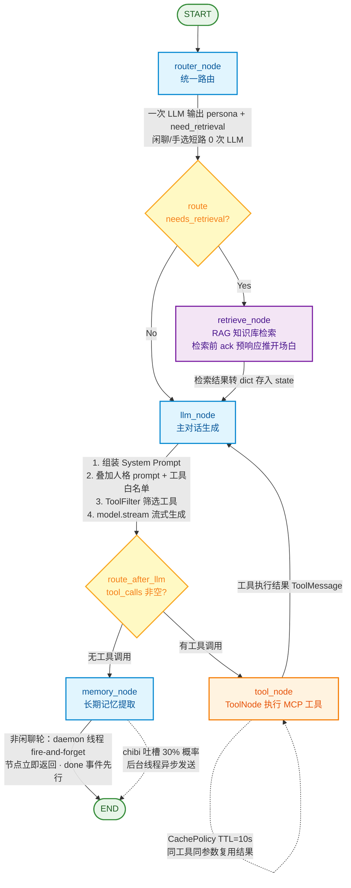

# Mitta AI 流程图

## 1. 主对话图（main_graph）



### 节点说明

| 节点                | 职责                | 关键实现                                                                                                                |
| ----------------- | ----------------- | ------------------------------------------------------------------------------------------------------------------- |
| **router_node** | 统一路由 | 一次 LLM 调用输出 `{persona, need_retrieval}`（`ROUTER_PROMPT`）；闲聊/自我介绍强模式短路 0 次 LLM；前端手选 `configurable.persona_override` 时 persona 直接采用、同调用只判 need_retrieval；解析失败兜底 persona=默认/手选、need_retrieval 保守 True |
| **retrieve_node** | 调用 RAG 子图检索知识库    | `retrieve_graph.invoke()`，Document 转 dict 存入 state（checkpoint 反序列化兼容）；进入子图前经 custom 通道推 ack 预响应开场白 |
| **llm_node**      | 核心生成节点            | 组装 System Prompt（默认+用户自定义+长期记忆+人格 prompt）→ ToolFilter 筛选工具 → 按人格白名单收缩 → `model.bind_tools()` → `model.stream()` → 合并 chunk 提取 tool_calls |
| **tool_node**     | 执行 MCP 工具         | LangGraph `ToolNode`，按工具名路由；CachePolicy 缓存同参数结果                                                                     |
| **memory_node**   | 提取长期记忆            | LLM 从对话中提取用户档案写入 PostgresStore；idle 闲聊轮快速跳过；非闲聊轮提取包进节点内 daemon 线程 fire-and-forget，节点立即返回、`done` 事件先行 |

### 条件路由

- **START → router_node**：统一路由（一次 LLM 出 persona + need_retrieval；闲聊/手选走短路），随后走条件边
- **router_node → route**：`needs_retrieval=True` 走检索链路，否则直接到 llm_node；快速短路命中时路由不做 LLM 调用直接 false
- **llm_node → route_after_llm**：`tool_calls` 非空走 tool_node，否则走 memory_node
- **tool_node → llm_node**：工具执行结果回到 LLM 生成最终回答（可多轮循环，工具调用上限按轮计数 `MAX_TOOL_ROUNDS=8`）

---

## 2. RAG 检索子图（retrieve_graph）

```mermaid
flowchart TD
    START([START]) --> CHECK_CACHE[check_cache<br/>检索缓存两级查找]

    CHECK_CACHE --> CACHE_HIT{L3a 精确命中?<br/>文本 hash · 0 embedding / 0 rerank}

    CACHE_HIT -->|命中| RETURN_CACHE[直接返回缓存文档<br/>reranked_docs]
    CACHE_HIT -->|未命中 → L3b 语义层| L3B{L3b 语义命中?<br/>LSH 分桶 + KNN + rerank 验证}

    L3B -->|命中| RETURN_CACHE
    L3B -->|未命中| PARALLEL[parallel_retrieve<br/>线程池扇出并行编排]

    PARALLEL -->|阶段一：rewrite ∥ dense(原问题) ∥ bm25| PARALLEL2[阶段二：dense(主查询) ∥ dense(子查询…)]
    PARALLEL2 -->|阶段三：串行| RRF[retrieve<br/>RRF 融合 k=60 · 去重]

    RRF -->|rrf_score 写入 metadata| RERANK[rerank<br/>pre_lex 词级 Jaccard 去重 44→20<br/>bge-reranker 精排 top_n=20]

    RERANK -->|relevance_score 写入 metadata| FILTER{filter<br/>relevance_score ≥ 0.15?}

    FILTER -->|通过| OUTPUT[output_node<br/>返回 Top 文档<br/>空则兜底 top 3]
    FILTER -->|过滤| OUTPUT
    OUTPUT --> STORE_CACHE[store_cache<br/>L3a + L3b 双写 · TTL 900s 续期]
    OUTPUT --> END_NODE([END])
    STORE_CACHE --> END_NODE

    classDef llmNode fill:#e1f5fe,stroke:#0288d1,stroke-width:2px,color:#01579b
    classDef vectorNode fill:#e8f5e9,stroke:#388e3c,stroke-width:2px,color:#1b5e20
    classDef cacheNode fill:#f3e5f5,stroke:#7b1fa2,stroke-width:2px,color:#4a148c
    classDef decision fill:#fff9c4,stroke:#f9a825,stroke-width:2px,color:#f57f17
    classDef terminal fill:#fce4ec,stroke:#c62828,stroke-width:2px,color:#b71c1c

    class PARALLEL,RRF vectorNode
    class RERANK llmNode
    class CHECK_CACHE,STORE_CACHE,RETURN_CACHE cacheNode
    class CACHE_HIT,L3B,FILTER decision
    class START,END_NODE,OUTPUT terminal
```

### 节点说明

| 节点                     | 职责                          | 关键实现                                                                                                                                            |
| ---------------------- | --------------------------- | ----------------------------------------------------------------------------------------------------------------------------------------------- |
| **check_cache**        | 检索缓存两级查找                    | 先 L3a 精确层 `query_exact_cache(question)`（文本 hash，0 embedding / 0 rerank），未命中再走 L3b 语义层 `query_cache(thread_id, question)`（LSH 分桶 + KNN + rerank 验证） |
| **parallel_retrieve**  | 并行编排（默认路径）        | 阶段一 `rewrite ∥ dense(原问题) ∥ bm25` 并发；阶段二 `dense(主查询) ∥ dense(子查询)` 并发；单路超时/失败只丢弃该路结果，不阻塞整体                                                        |
| **retrieve**           | RRF 融合 + 去重                 | Reciprocal Rank Fusion（k=60）融合稠密多路 + BM25，按 doc_id 去重、按文本去重；RRF 分写入 `metadata["rrf_score"]` 供 pre 阶段多样性去重当相关性信号                                |
| **rerank**             | 候选去重 + 在线重排 + 多样性选择         | `MMR_STAGE=pre_lex`（默认）：RRF 候选池先做词级 Jaccard 去重（44→20 篇）→ SiliconFlow `BAAI/bge-reranker-v2-m3` 精排 top_n=20 → 分数写入 `metadata["relevance_score"]`    |
| **filter**             | 相关性阈值过滤                     | 过滤 `relevance_score < 0.15` 的噪声文档；过滤后为空时兜底返回原始 top 3（宁可不准确也不返回空）                                                     |
| **store_cache**        | 写入 Redis（L3a + L3b 双写）      | L3a `rcache:x:{kb_ver}:{hash(问题)}`；L3b `retrieve_cache:{thread_id}:{bucket_id}`；动态 TTL 900s，命中自动续期                                              |

### 并行编排

**真实依赖**：`rewrite` 依赖 question + history；`dense(原问题)` 与 `bm25` 只依赖 question，**都不依赖改写**；只有 `dense(改写后各路)` 必须等 rewrite。

```
阶段一（并发）：rewrite  ∥  dense(原问题)  ∥  bm25
阶段二（并发）：dense(主查询) ∥ dense(子查询1) ∥ dense(子查询2)
阶段三（串行）：RRF 融合 → rerank → filter
```

**为什么用线程池而不是 LangGraph 并行边**：主图是同步 `invoke`（`chat_service` 里 `asyncio.to_thread(graph.invoke)`），
LangGraph 的**同步 superstep 对同一批无依赖节点是串行执行**的，只加边不加执行器不会变快
（要真并发得把节点改 async + 全链路换 `ainvoke`）。所以在单节点内用 `ThreadPoolExecutor` 扇出。

**降级策略**（任一路失败只丢弃该路，不抛异常）：

| 失败路             | 降级动作                          | 影响                     |
| --------------- | ----------------------------- | ---------------------- |
| rewrite 超时/异常   | `rewritten_queries = [原问题]`   | 退化为「原问题 + BM25」两路，仍出结果 |
| dense(任一路) 失败   | 该路贡献 0 条候选                    | 其余路不受影响                |
| bm25 失败         | 稀疏路为空                         | RedisSearch 不可用时常见     |
| 全部稠密路失败         | 只剩 BM25                       | 仍走 rerank/filter，不返回空  |

超时常量：改写 10s / 稠密 8s / BM25 3s。注意 Python 无法强制杀线程，超时是「不再等待该 future 的结果」。

### 关键参数

| 参数                     | 值                                                                                                                                   | 位置                                                                                       |
| ---------------------- | ----------------------------------------------------------------------------------------------------------------------------------- | ---------------------------------------------------------------------------------------- |
| 稠密召回 n_results        | 20/路（原问题 + 主查询 + 子查询，最多 4 路）                                                                                                        | `graphs/nodes/retrieve/parallel_nodes.py`                                                |
| BM25 召回 top_k         | 20                                                                                                                                  | `graphs/nodes/retrieve/query_nodes.py` `run_bm25`                                        |
| RRF_K                  | 60                                                                                                                                  | `constant/retrieval_constants.py`                                                        |
| 重排候选 top_n            | 20                                                                                                                                  | `constant/retrieval_constants.py` `MMR_TOP_CANDIDATES`                                   |
| **MMR 档位** `MMR_STAGE` | `pre_lex`（默认，rerank 前词级 Jaccard 去重 44→20）／`pre`（向量 MMR）／`post`（rerank 后，已证伪）／`off`                                                   | `constant/retrieval_constants.py`                                                        |
| MMR 词级去重阈值             | `MMR_LEXICAL_JACCARD=0.35`，`MMR_PRE_SELECT=20`                                                                                       | `constant/retrieval_constants.py`                                                        |
| MMR λ                  | `MMR_LAMBDA=0.5`（post）／`MMR_PRE_LAMBDA=0.7`（pre）                                                                                     | `constant/retrieval_constants.py`                                                        |
| 并行编排开关                 | `RETRIEVE_PARALLEL_ENABLED=1`（默认），`RETRIEVE_PARALLEL_WORKERS=4`                                                                       | `constant/retrieval_constants.py`                                                        |
| 单路超时                   | 改写 `REWRITE_TIMEOUT_SEC=10` / 稠密 `DENSE_TIMEOUT_SEC=8` / BM25 `SPARSE_TIMEOUT_SEC=3`                                                 | `constant/retrieval_constants.py`                                                        |
| 过滤阈值                   | 0.15（relevance_score ≥ 0.15，最多取 8 篇，空则兜底 top 3，常量 `RERANK_FILTER_THRESHOLD`）                              | `constant/retrieval_constants.py` + `graphs/nodes/retrieve/fusion_nodes.py` filter_node  |
| 缓存分层开关                 | `CACHE_LAYER_ENABLED=1`（默认）                                                                                                         | `constant/cache_constant.py`                                                             |
| 缓存 TTL                 | L1 改写 24h／L2 向量 7d／L3 检索结果动态 900s（命中续期）                                                                                             | `constant/cache_constant.py`                                                             |
| 缓存强命中阈值                | `CACHE_RERANK_STRONG_HIT=0.7`（两段式验证快通道）、`CACHE_RERANK_HIT_SCORE=0.5`、`CACHE_KNN_FAST_K=3`                                            | `constant/cache_constant.py`                                                             |
| 知识库版本键                 | `KB_VERSION=v1`（入库重灌即失效全部 L3a/L3b）                                                                                                   | `constant/cache_constant.py`                                                             |
| Embedding 模型           | BAAI/bge-m3（1024 维）                                                                                                                 | `constant/embedding_constants.py`                                                        |
| 切分 chunk               | 800 / overlap 100（chunks 270）                                                                                                       | `constant/embedding_constants.py`                                                        |
| 重排模型                   | BAAI/bge-reranker-v2-m3                                                                                                             | `init.py`                                                                                |
| BM25 索引名               | kb_bm25                                                                                                                             | `constant/cache_constant.py`                                                             |
